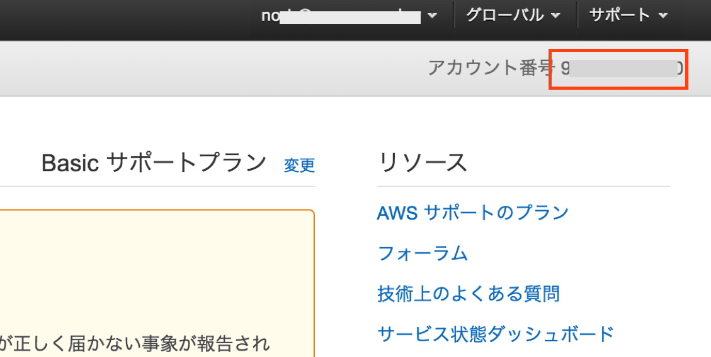
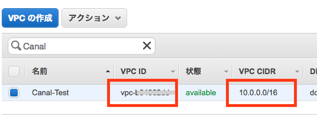
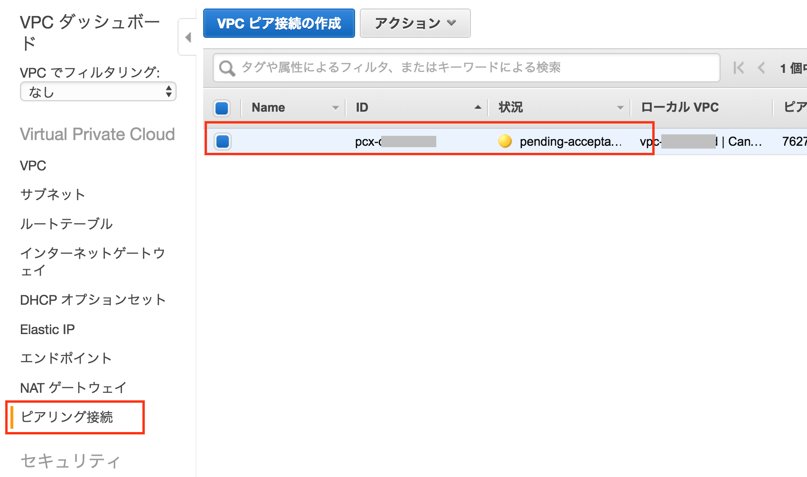
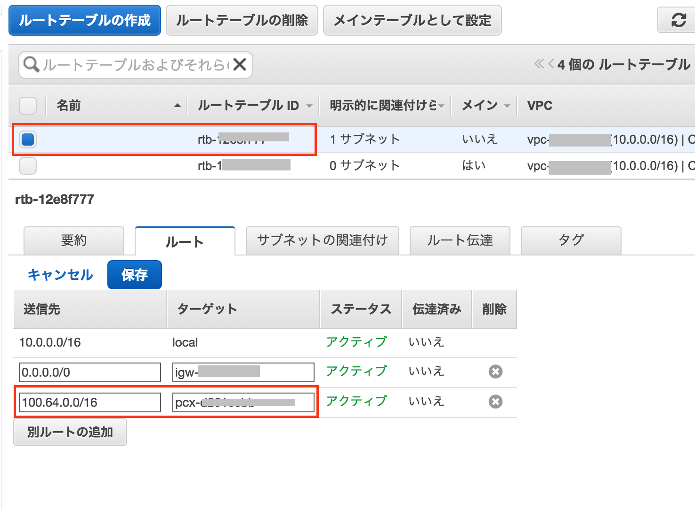
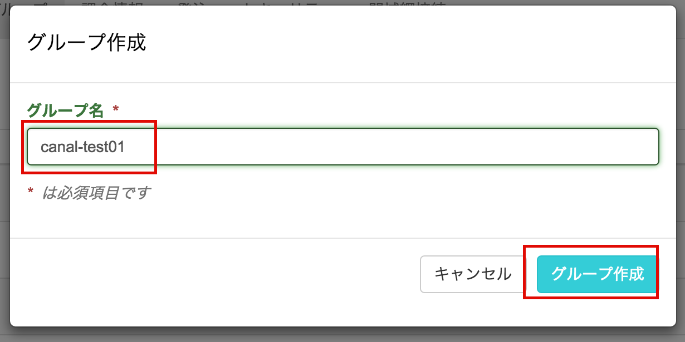
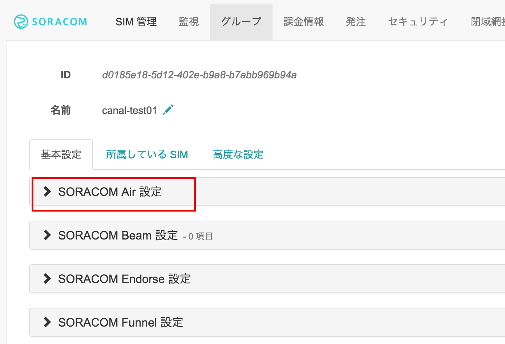
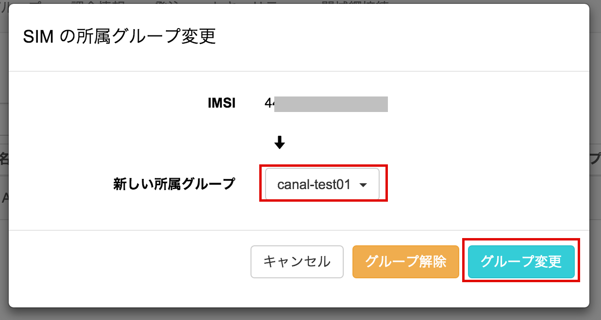

# SORACOM Canal ＆ Gate ハンズオン

## はじめに
このハンズオンでは、SORACOM と AWS を使用したモバイル閉域網接続環境を実際に構築し、プライベートIPアドレスで端末とEC2インスタンス間で通信が行えることを確認します。

## 前提
本ハンズオンでは、以下を前提としています。

- SORACOM のアカウントをお持ちであること
- SORACOM Air の SIM(Air SIM)、および使用できるデバイス、スマートフォンをお持ちであること
- AWSのアカウントをお持ちであること

### Amazon VPCについて
VPC について詳しく知りたい方は、以下のガイド(AWS公式ドキュメント)も合わせてご参照ください。

- [VPC 入門ガイド　](http://docs.aws.amazon.com/AmazonVPC/latest/GettingStartedGuide/)
- [VPC ピアリングの機能解説](http://docs.aws.amazon.com/AmazonVPC/latest/PeeringGuide/)

## ハンズオンの流れ
ハンズオンは以下のような流れで行います

- SORACOM アカウントの作成 〜 Air SIM の登録
- SORACOM Canal を使ってモバイルで閉域網通信を行う
  - AWS VPC の構築
  - SORACOM Canal の設定
  - デバイスから Canal への疎通確認
- SORACOM Gate を使ってデバイスにアクセスする
  - Gate を有効化する
  - インスタンス上でVXLANの設定を行う
  - インスタンスからデバイスにアクセスする

## SORACOM Canal とは

SORACOM Canal （以下、Canal）は、Amazon Web Services(AWS) 上に構築したお客様の仮想プライベートクラウド環境(Amazon Virtual Private Cloud、以下、VPC)と SORACOM プラットフォームを直接接続するプライベート接続サービスです。

SORACOM プラットフォームは、AWS の VPC 上に構築されています。そのため、VPC 間を接続する「VPC ピアリング」という機能を使うことで、SORACOM の VPC とお客様の VPC を AWS 内で閉じた環境で接続することができます。

Canal でピアリング接続対象の VPC は、AWS のアジアパシフィック(東京)リージョン上となります。

Canal は、Virtual Private Gateway(以下、VPG)とよばれる SORACOM Air とお客様の VPC を仲介するゲートウェイを利用して、お客様の VPC とピアリング接続します。

VPG の作成時には、インターネットへのルーティングを行うか、ピアリング先のみにするかを設定することができます。ピアリング先のみを設定した場合は、インターネットアクセスを許可しない完全閉域網となります。

なお、VPG の利用の有無は、SORACOM Air のグループごとに設定できます。

このため、同じ Air SIM であっても所属するグループを変更することで、お客様の VPC へのアクセス可否を切り替えることが可能です。

Canal の利用を開始するステップは、以下の通りです。(当ガイドも以下のステップでご紹介します。)

- ステップ 1: [AWS の設定] VPC、および EC2インスタンスを作成する
- ステップ 2: [SORACOM の設定] VPG を作成し、VPCピア接続を設定する
- ステップ 3: [AWS の設定] ピアリング接続を受諾し、ネットワークを設定する
- ステップ 4: 閉域網で接続する

以降、上記の4つのステップにそって、手順をご説明します。なお、ステップ1については、AWS Cloud Formation のテンプレートを用意しています。

## ステップ 1: VPC、および EC2 インスタンスを作成する
ここでは、以下の赤の点線部分を作成します。

# TODO: ここは CloudForamtion を使用するようにざっくり変更する

PC のブラウザを起動して、アクセスしてみましょう。

SSH でのログインに使用したドメイン(例えば、ec2-52-196-xxx-xxx.ap-northeast-1.compute.amazonaws.com)でアクセスします。

Apache にアクセスすることができました。

ここでは、グローバル IP アドレスで EC2 にアクセスしていますが、Canal をセットアップすることで、プライベートアドレスでアクセスできるようになります。

以上で、「ステップ 1: VPC、および EC2インスタンスを作成する」は完了です。

## ステップ 2: VPG を作成し、VPC ピア接続を設定する

ここでは、VPG を作成し、VPC ピア接続を設定します。以下の赤の点線部分を作成します。

###  VPG の作成

SORACOM のユーザーコンソールにログインします。

画面上部のメニューから「閉域網接続」を選択します。

「VPG を追加」をクリックします。

VPG の名前を入力し、対象サービスとして「Canal」を選択します。

> 「インターネットゲートウェイを使う」は、冒頭で紹介したインターネットへのルーティングを行うか、ピアリング先のみにするかの設定となります。  
> 「インターネットゲートウェイを使う」を OFF にした場合は、インターネットアクセスを許可しない完全閉域網となります。ここでは、インタネットゲートウェイを ON にします。

「作成」をクリックすると、以下のように「状態」が「作成中」となります。

しばらく(3分程度)して、「実行中」となれば作成完了です。

次に、「ステップ１」で作成した VPC にピア接続を設定します。

ピア接続の設定には、以下の情報が必要となります。

- AWS のアカウント番号
- 接続先の VPC ID
- VPC の アドレスレンジ (CIDR)

AWS のアカウント番号は、AWS マネジメントコンソールの右上にある「サポート」→「サポートセンター」をクリックし、表示されるサポートセンターの右上で確認できます。

VPC ID と VPC のアドレスレンジ(VPC CIDR)は AWS マネジメントコンソールから VPC ダッシュボードの「VPC」で一覧から確認することができます。

###  VPC ピア接続の設定

では、ピア接続を設定します。

先ほど作成した VPG を選択します。

「基本設定」→「VPC ピア接続」から「追加」をクリックします。

以下の情報を入力して、「作成」をクリックします。

この操作で、「 ステップ 1: VPC、および EC2 インスタンスを作成する」で作成した VPC に SORACOM からピア接続がリクエストされています。

以上で、「ステップ 2: VPG を作成し、VPC ピア接続を設定します。」は完了です。

## ステップ 3: ピアリング接続を受諾し、ネットワークを設定

ここでは、「ステップ 1: VPC、および EC2 インスタンスを作成する」で作成した VPC で、ピア接続を受諾し、ネットワークの設定(ルートテーブルの設定)を行います。

AWS のマネジメントコンソールから VPC ダッシュボードに移ります。

「VPC ピアリング」を選択します。以下のようにピアリングのリクエストを確認してください。

当該のピアリングを選択して、「アクション」から「リクエストの承認」を選択してください。

以下のようなウィンドウが表示されますので、「ルートテーブルを今すぐ変更」を選択し、ルートテーブルを変更します。

インスタンスが含まれるルートテーブルを選択し、「100.64.0.0/16」を受諾したピアリング接続(pcx-xxxxxx)にします。当ガイドの手順で作成した場合、「１個のパブリックサブネットを持つ VPC」を作成しているので、「明示的に関連付けられた」サブネットが「1 サブネット」と表示されているルートテーブルになります。

VPG のアドレスレンジは、100.64.0.0/16 となりますので、当アドレスの送信先を VPG とします。

「保存」をクリックします。

以上で、ピア接続の受諾、および、ルートテーブルの設定は完了しました。

## ステップ 4: 閉域網で接続する

いよいよ、Canal を通じて、閉域網の接続を行います。

以下の手順で接続します。

- グループを作成し VPG を設定する
- Air SIM をグループに所属させる
- Air SIM からプライベートアドレスでアクセスします。

###  グループを作成し VPG を設定する

SORACOM ユーザーコンソールから「グループ」を選択します。

「追加」をクリックして、グループ名を入力し、グループを作成します。

作成したグループをクリックしグループ画面の「基本設定」から「SORACOM Air 設定」を開きます。

「SORACOM Air 設定」内に、以下のように「VPG (Virtual Private Gateway) 設定」がありますので、「ON」とし、ステップ2で作成した「VPG」を選択します。

「保存」をクリックします。

> VPG を指定したグループに含まれる Air SIM は VPG を利用することになります。  
> Air SIM の所属するグループを切り替えることで、同じ Air SIM であっても VPG を利用する/しないを切り替えることができます。これにより、閉域網接続の可否を切り替えることができます。

###  Air SIM をグループに所属させる
「SIM 管理」メニューから、接続を行う SIM を選択し、「所属グループ変更」をクリックします。

先ほど作成したグループに所属させます。

###  Air SIM からプライベートアドレスでアクセスする

VPG を使用するグループから、「ステップ 1: VPC、および EC2 インスタンスを作成する」で作成した VPC 内の EC2 インスタンスにアクセスします。

グループを変更しましたので、既に接続中のデバイスについては、設定変更後に一旦接続を切ってから繋ぎ直してください。（Air Plain (＜機内＞)モードの On / Off、SIM の状態を一旦「休止状態」にしするなど）

ブラウザを起動し、EC2 インスタンスのプライベートアドレスを入力します。

プライベートアドレスである「10.0.0.254」でアクセスできています！

以上で、「SORACOM Canal を使用して閉域網でサーバーに接続する」は完了です。

Canal を利用することにより、インターネットを介することなく、VPC にアクセスすることが可能となります。また、 VPC もインターネットにポートを開ける必要はありません。

当ガイドでは、VPG のインターネットゲートウェイを「ON」として作成しましたが、「OFF」(ピア接続先のみ)を設定した場合は、インターネットアクセスを許可しない完全閉域網となります。インターネットからデバイスにマルウエアを仕込まれるリスクを回避することも可能となります。

## [参考] Cloud Formation テンプレートを使用して VPC、および EC2 インスタンスを作成する

ここでは、「ステップ 1: VPC、および EC2 インスタンスを作成する」で作成、および設定した VPC、EC2 を Cloud Formation テンプレート を使用して作成します。

事前に EC2 インスタンスのキーペアが必要です。まずキーペアを作成してください。

AWS マネジメントコンソールの EC2 ダッシュボードから、「キーペア」をクリックし、「キーペアの作成」を行います。

キーペア名を入力します。

次に、Cloud Formation テンプレートから VPC、EC2 を作成します。[こちら](/jp/files/canal-ec2.json)から、Cloud Formation テンプレートをダウンロードしてください。

AWS マネジメントコンソールの Cloud Formation ダッシュボードから、「Create Stack」をクリックします。

[こちらからダウンロード](/jp/files/canal-ec2.json)したファイルを選択します。

「Stack name」、「KeyName」を入力します。「Stack name」は任意の名前をつけてください。「KeyName」は先ほど作成したキーペア名となります。

「Next」をクリックします。

「Create」をクリックします。

Status が「CREATE\_COMPLETE」となれば作成されています。

Canal の作成に必要な情報が「Outputs」タブに表示されているので、ご確認ください。

引き続き、を行ってください。
