# SORACOM Canal ＆ Gate ハンズオン

## はじめに
このハンズオンでは、SORACOM と AWS を使用したモバイル閉域網接続環境を実際に構築し、プライベートIPアドレスで端末とEC2インスタンス間で通信が行えることを確認します。

## 前提
本ハンズオンでは、以下を前提としています。

- SORACOM のアカウントをお持ちであること
- SORACOM Air の SIM(Air SIM)、および使用できるデバイス(スマートフォン・タブレット、モバイルルータなど)をお持ちであること
- AWSのアカウントをお持ちであること

### SORACOM のアカウント開設とSIMの登録
SORACOMのアカウントを取得されていない方は、以下のガイドに従い、アカウントの作成と支払情報の設定を行ってください。

- <a target="\_blank" href="https://dev.soracom.io/jp/start/console/#account">アカウントの作成</a>
- <a target="\_blank" href="https://dev.soracom.io/jp/start/console/#payment">支払い情報の設定</a>

既にアカウントをお持ちであるか、上記を済ませた後、SIMの登録をお済ませください。

- <a target="\_blank" href="https://dev.soracom.io/jp/start/console/#registsim">Air SIMの登録</a>

### Amazon VPCについて
VPC について詳しく知りたい方は、以下のガイド(AWS公式ドキュメント)も合わせてご参照ください。

- <a target="\_blank" href="http://docs.aws.amazon.com/AmazonVPC/latest/GettingStartedGuide/">VPC 入門ガイド</a>
- <a target="\_blank" href="http://docs.aws.amazon.com/AmazonVPC/latest/PeeringGuide/">VPC ピアリングの機能解説</a>

## ハンズオンの流れ
ハンズオンは以下のような流れで行います

- SORACOM アカウントの作成 〜 Air SIM の登録
- SORACOM Canal を使ってモバイルで閉域網通信を行う
  - AWS VPC の構築
  - SORACOM Canal の設定
  - デバイスから Canal への疎通確認
- SORACOM Gate を使ってデバイスにアクセスする
  - Gate を有効化する
  - インスタンス上でVXLANの設定を行う
  - インスタンスからデバイスにアクセスする

## SORACOM Canal とは

SORACOM Canal （以下、Canal）は、Amazon Web Services(AWS) 上に構築したお客様の仮想プライベートクラウド環境(Amazon Virtual Private Cloud、以下、VPC)と SORACOM プラットフォームを直接接続するプライベート接続サービスです。

SORACOM プラットフォームは、AWS の VPC 上に構築されています。そのため、VPC 間を接続する「VPC ピアリング」という機能を使うことで、SORACOM の VPC とお客様の VPC を AWS 内で閉じた環境で接続することができます。

Canal でピアリング接続対象の VPC は、AWS のアジアパシフィック(東京)リージョン上となります。

Canal は、Virtual Private Gateway(以下、VPG)とよばれる SORACOM Air とお客様の VPC を仲介するゲートウェイを利用して、お客様の VPC とピアリング接続します。


VPG の作成時には、インターネットへのルーティングを行うか、ピアリング先のみにするかを設定することができます。ピアリング先のみを設定した場合は、インターネットアクセスを許可しない完全閉域網となります。

なお、VPG の利用の有無は、SORACOM Air のグループごとに設定できます。

このため、同じ Air SIM であっても所属するグループを変更することで、お客様の VPC へのアクセス可否を切り替えることが可能です。


Canal の利用を開始するステップは、以下の通りです。(当ガイドも以下のステップでご紹介します。)

- ステップ 1: [AWS の設定] VPC、および EC2インスタンスを作成する
- ステップ 2: [SORACOM の設定] VPG を作成し、VPCピア接続を設定する
- ステップ 3: [AWS の設定] ピアリング接続を受諾し、ネットワークを設定する
- ステップ 4: 閉域網で接続する

以降、上記の4つのステップにそって、手順をご説明します。なお、ステップ1については、AWS Cloud Formation のテンプレートを用意しています。

## SORACOM Canal のセットアップ

### ステップ 1: VPC、および EC2 インスタンスを作成する
ここでは、以下の赤の点線部分を作成します。


本ハンズオンでは、Cloud Formation テンプレートを使用して VPC、および EC2 インスタンスを作成します。

> もし全て手動で構成をしてみたいという方は、[「SORACOM Canal Getting Started ガイド - ステップ1」](https://dev.soracom.io/jp/start/canal/#step1) を参照下さい。

事前に EC2 インスタンスのキーペアが必要です。まずキーペアを作成してください。

<a target="\_blank" href="https://ap-northeast-1.console.aws.amazon.com/ec2/v2/home?region=ap-northeast-1#KeyPairs:sort=keyName">AWS マネジメントコンソールの EC2 ダッシュボード</a> から、「キーペアの作成」を行います。

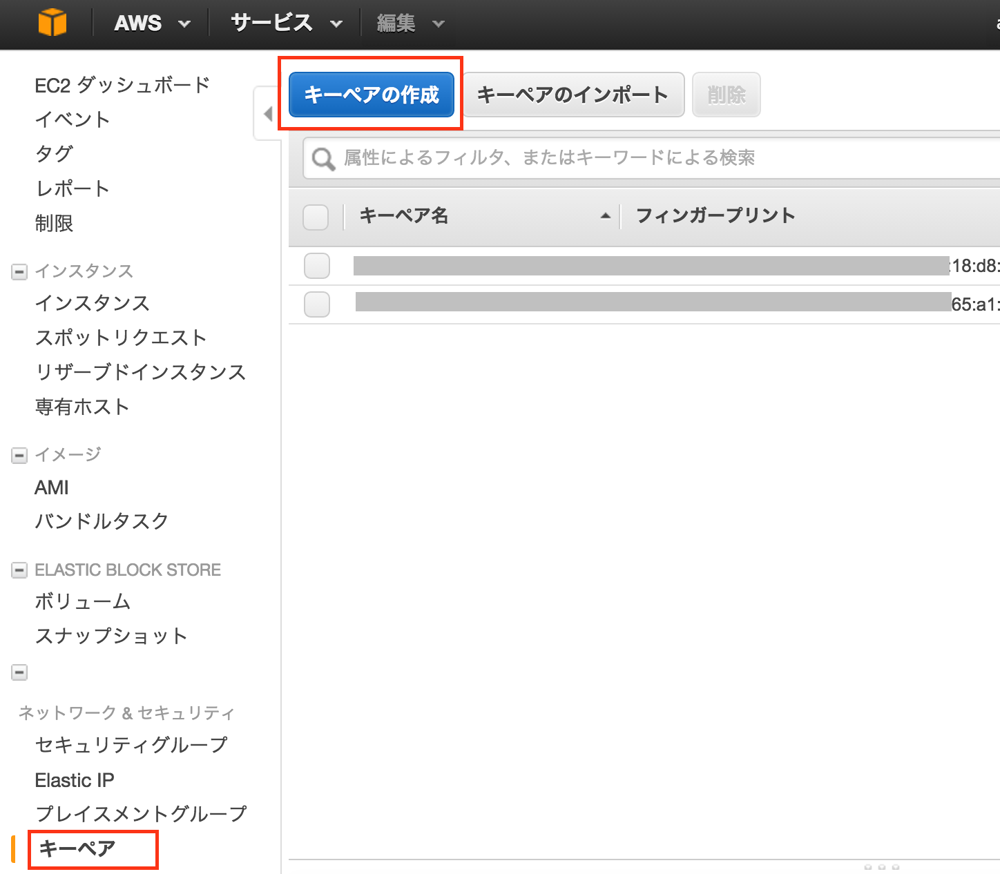

キーペア名を入力します。

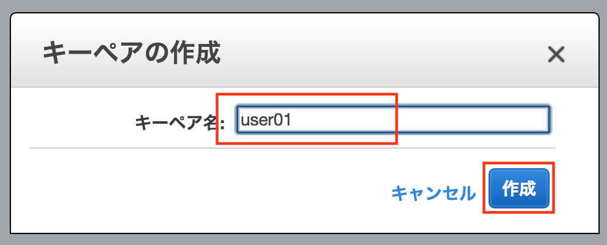

次に、Cloud Formation テンプレートから VPC、EC2 を作成します。

<a target="\_blank" href="https://console.aws.amazon.com/cloudformation/home?region=ap-northeast-1#cstack=sn~canal-test|turl~https://s3.amazonaws.com/soracom-files/canal-ec2.json">こちらのリンク</a> から、CloudFormation の　Stack 作成画面を開き、「Next」をクリックします。


スタックの名前とパラメータを指定します。

- 「Stack name」は任意の名前をつけてください。
- 「KeyName」は先ほど作成したキーペア名となります。
- 「InstanceType」は AWS の無料使用枠を使うのであればデフォルトの「t2.micro」のまま、もし無料枠の対象でない場合には、「t2.nano」に変更してもよいでしょう。


「Next」をクリックします。

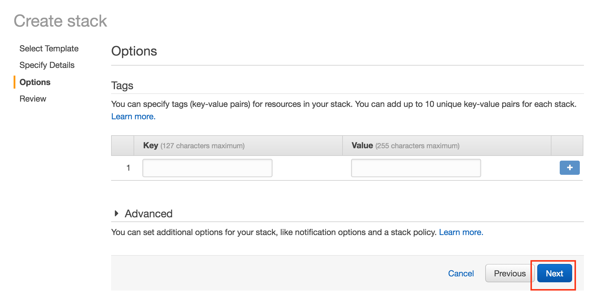

「Create」をクリックします。

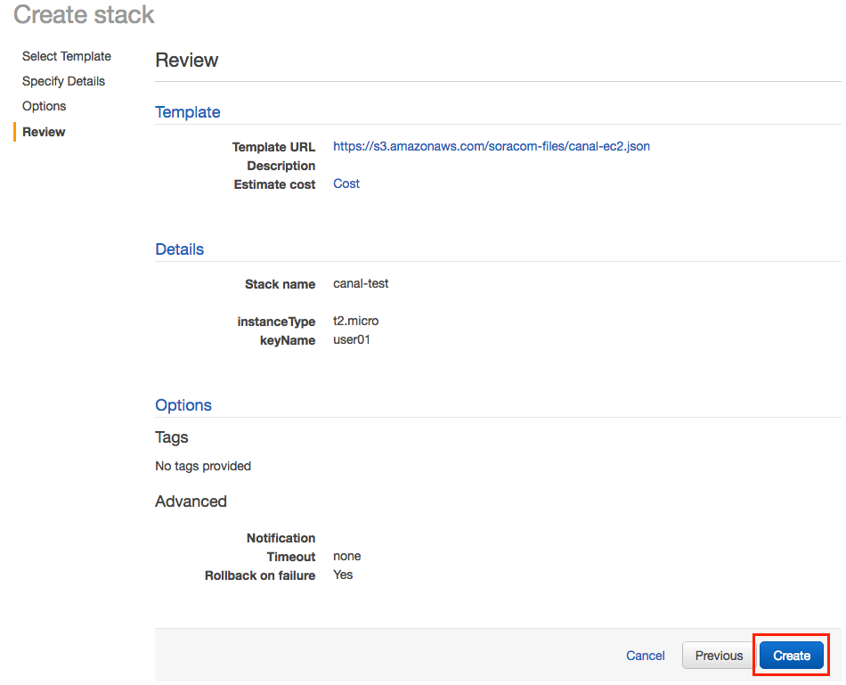

Status が「CREATE_COMPLETE」となれば作成されています。


必要な情報が「Outputs」タブに表示されているので、ご確認ください。

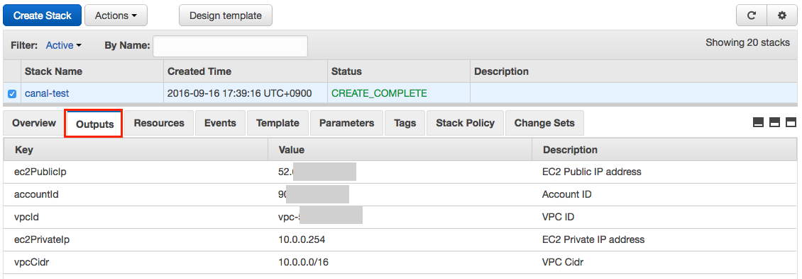

Outputs の ec2PublicIp に表示されているIPアドレスにPCのブラウザでアクセスしてみましょう。


Apache にアクセスすることができました。

ここでは、グローバル IP アドレスで EC2 にアクセスしていますが、Canal をセットアップすることで、プライベートアドレスでアクセスできるようになります。

以上で、「ステップ 1: VPC、および EC2インスタンスを作成する」は完了です。

### ステップ 2: VPG を作成し、VPC ピア接続を設定する

ここでは、VPG を作成し、VPC ピア接続を設定します。以下の赤の点線部分を作成します。


####  VPG の作成

SORACOM のユーザーコンソールにログインします。

画面上部のメニューから「閉域網接続」を選択します。


「VPG を追加」をクリックします。


VPG の名前を入力し、対象サービスとして「Canal」を選択します。

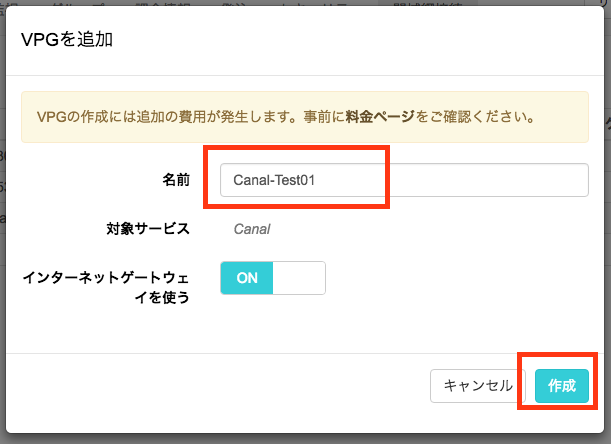

> 「インターネットゲートウェイを使う」は、冒頭で紹介したインターネットへのルーティングを行うか、ピアリング先のみにするかの設定となります。  
> 「インターネットゲートウェイを使う」を OFF にした場合は、インターネットアクセスを許可しない完全閉域網となります。ここでは、インタネットゲートウェイを ON にします。

「作成」をクリックすると、以下のように「状態」が「作成中」となります。


しばらく(3分程度)して、「実行中」となれば作成完了です。

次に、「ステップ１」で作成した VPC にピア接続を設定します。

ピア接続の設定には、以下の情報が必要となります。

- AWS のアカウント番号
- 接続先の VPC ID
- VPC の アドレスレンジ (CIDR)

AWS のアカウント番号は、AWS マネジメントコンソールの右上にある「サポート」→「サポートセンター」をクリックし、表示されるサポートセンターの右上で確認できます。

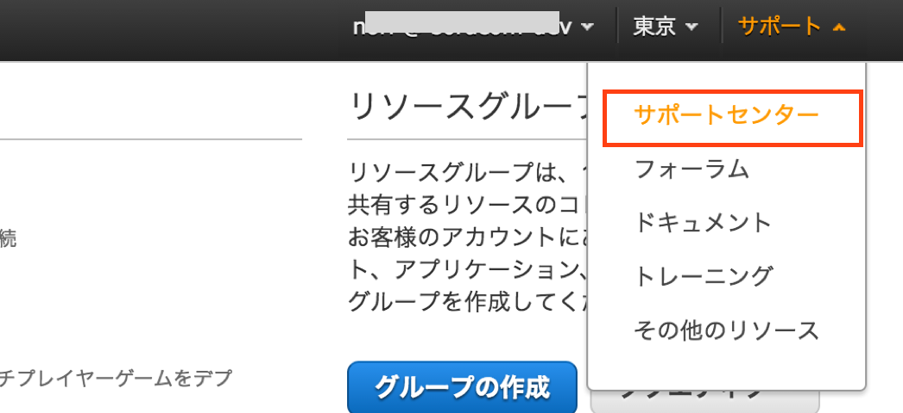


VPC ID と VPC のアドレスレンジ(VPC CIDR)は AWS マネジメントコンソールから VPC ダッシュボードの「VPC」で一覧から確認することができます。


####  VPC ピア接続の設定

では、ピア接続を設定します。

先ほど作成した VPG を選択します。


「基本設定」→「VPC ピア接続」から「追加」をクリックします。


以下の情報を入力して、「作成」をクリックします。

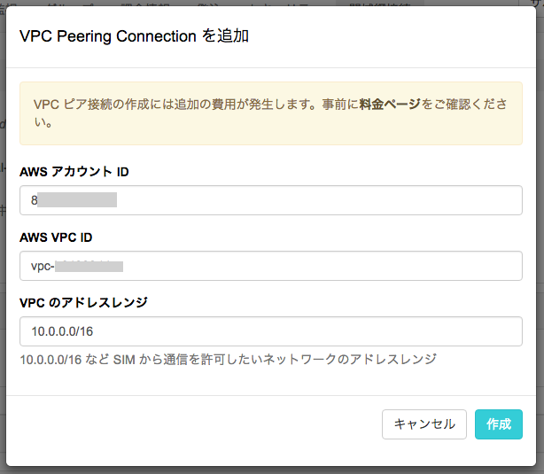

この操作で、「 ステップ 1: VPC、および EC2 インスタンスを作成する」で作成した VPC に SORACOM からピア接続がリクエストされています。

以上で、「ステップ 2: VPG を作成し、VPC ピア接続を設定します。」は完了です。

### ステップ 3: ピアリング接続を受諾し、ネットワークを設定

ここでは、「ステップ 1: VPC、および EC2 インスタンスを作成する」で作成した VPC で、ピア接続を受諾し、ネットワークの設定(ルートテーブルの設定)を行います。

AWS のマネジメントコンソールから VPC ダッシュボードに移ります。

「VPC ピアリング」を選択します。以下のようにピアリングのリクエストを確認してください。


当該のピアリングを選択して、「アクション」から「リクエストの承認」を選択してください。


以下のようなウィンドウが表示されますので、「ルートテーブルを今すぐ変更」を選択し、ルートテーブルを変更します。


インスタンスが含まれるルートテーブルを選択し、「100.64.0.0/16」を受諾したピアリング接続(pcx-xxxxxx)にします。当ガイドの手順で作成した場合、「１個のパブリックサブネットを持つ VPC」を作成しているので、「明示的に関連付けられた」サブネットが「1 サブネット」と表示されているルートテーブルになります。

VPG のアドレスレンジは、100.64.0.0/16 となりますので、当アドレスの送信先を VPG とします。


「保存」をクリックします。

以上で、ピア接続の受諾、および、ルートテーブルの設定は完了しました。

### ステップ 4: 閉域網で接続する

いよいよ、Canal を通じて、閉域網の接続を行います。

以下の手順で接続します。

- グループを作成し VPG を設定する
- Air SIM をグループに所属させる
- Air SIM からプライベートアドレスでアクセスします。

####  グループを作成し VPG を設定する

SORACOM ユーザーコンソールから「グループ」を選択します。


「追加」をクリックして、グループ名を入力し、グループを作成します。


作成したグループをクリックしグループ画面の「基本設定」から「SORACOM Air 設定」を開きます。


「SORACOM Air 設定」内に、以下のように「VPG (Virtual Private Gateway) 設定」がありますので、「ON」とし、ステップ2で作成した「VPG」を選択します。


「保存」をクリックします。

> VPG を指定したグループに含まれる Air SIM は VPG を利用することになります。  
> Air SIM の所属するグループを切り替えることで、同じ Air SIM であっても VPG を利用する/しないを切り替えることができます。これにより、閉域網接続の可否を切り替えることができます。

#### Air SIM をグループに所属させる
「SIM 管理」メニューから、接続を行う SIM を選択し、「所属グループ変更」をクリックします。

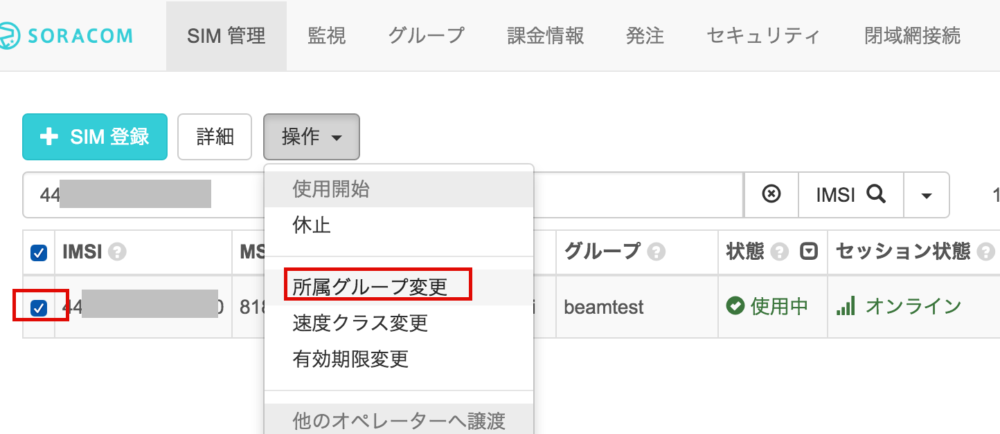

先ほど作成したグループに所属させます。


#### SIMを再接続する(重要)

SIMが接続するVPGの設定を変更しましたので、既に接続中のデバイスについては、設定変更後に一旦接続を切ってから繋ぎ直してください。

再接続する方法には、以下があります

- デバイスが手元にある場合
  - スマホ・タブレット等：Air Plane (＜機内＞)モードがある場合 On / Off
  - ラズパイ等の場合：3G/LTEの再接続(pppのリスタートなど)
  - その他：デバイス自体の再起動
- デバイスが遠隔地にある場合
  - ユーザコンソールから、当該のSIM を一旦「休止」して、再度「使用開始」を行う
  - <a target="\_blank" href="https://dev.soracom.io/jp/docs/api/#!/Subscriber/deleteSubscriberSession">deleteSubscriberSession API</a>を実行する

####  Air SIM からプライベートアドレスでアクセスする

VPG を使用するグループから、「ステップ 1: VPC、および EC2 インスタンスを作成する」で作成した VPC 内の EC2 インスタンスにアクセスします。

ブラウザを起動し、EC2 インスタンスのプライベートアドレスを入力します。

プライベートアドレスである「10.0.0.254」でアクセスできています！

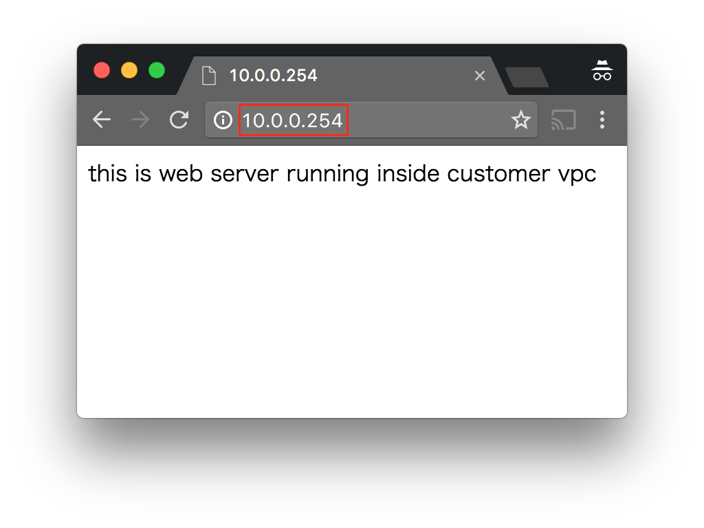

以上で、「SORACOM Canal のセットアップ」は完了です。

Canal を利用することにより、インターネットを介することなく、VPC にアクセスすることが可能となります。また、 VPC もインターネットにポートを開ける必要はありません。

> 当ガイドでは、VPG のインターネットゲートウェイを「ON」として作成しましたが、「OFF」(ピア接続先のみ)を設定した場合は、インターネットアクセスを許可しない完全閉域網となります。インターネットからデバイスにマルウエアを仕込まれるリスクを回避することも可能となります。

## SORACOM Gate とは

SORACOM Gate（以下、Gate）はお客様のネットワークとデバイスを LAN 接続するサービスで、IoT デバイスへのセキュアな接続を実現します。SORACOM外のネットワークに、ゲートウェイとなるサーバ（以下、Gate Peer）を作成し SORACOM Virtual Private Gateway (以下、VPG) と仮想的な L2 ネットワークを構築することで、お客様のVPCからデバイスへのセキュアな接続とデバイス間での通信が可能となります。

### Gate の特徴
Gate には IoT デバイスの活用に役立つ2つの特徴があります。

#### お客様VPCからデバイスへの直接アクセス機能
SORACOM 外のネットワークと Gate を有効化した VPG との間で、トンネルを張ることによって仮想的な L2 ネットワークを構成することができます。トンネリングされた SORACOM 外のネットワークと、VPG 配下のデバイスのネットワークが接続され、SORACOM 外のネットワークからVPGを経由してデバイスにプライベート IP アドレスでアクセスできるようになります。なお、現時点ではトンネリング技術として VXLAN を採用しています。

#### デバイス間通信機能
Gate を有効化すると、VPGとIoTデバイスが同じ仮想的なサブネット (Virtual Subnet) に配置されます。すなわち、Gateが有効化されているグループに所属するデバイスであれば、グループ内のデバイス同士で通信することも可能です。

> 本ハンズオンでは、デバイス間の直接アクセスを行うステップは含まれておりません。  
> 追加で Air SIM を入手して、同じ VPG に所属させることで簡単にアクセスが出来ますので、ぜひお試し下さい。

次章では、Canal と Gate を組み合わせ、Amazon Web Services(AWS) 上に構築したお客様の仮想プライベートクラウド環境(Amazon Virtual Private Cloud、以下、VPC)と、デバイスが双方向で通信できる環境を構築する手順を紹介します。

## SORACOM Gate のセットアップ
セットアップから接続確認までは6つのステップに分かれています。

- [ステップ 5: Gate Peer となる EC2 インスタンスを登録する](#step5)
- [ステップ 6: (AWS の設定) Gate Peer に VXLAN の設定を投入する](#step6)
- [ステップ 7: Gate を有効化する](#step7)
- [ステップ 8: Gate Peer からデバイスに接続できることを確認する](#step8)
- [ステップ 9: 使い終わったリソースを削除する](#step9)
- [参考: トンネリング技術の概要](#tunneling)

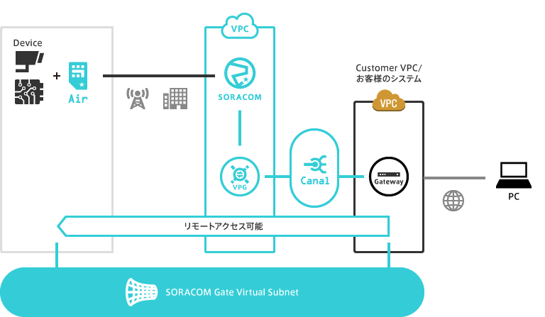

### ステップ 5: Gate Peer となる EC2 インスタンスを登録する
VPG 設定画面＞「高度な設定」で、「お客様の Gate Peer 一覧」にある「Gate Peer を追加」ボタンをクリックします。


ダイアログで Gate Peer の IP アドレスを登録します。

- トンネル接続用 IP アドレス: Gate Peer となる EC2 インスタンスのプライベート IP アドレスを指定してください。この項目は入力必須です。
- デバイスサブネット内 IP アドレス：この項目の入力は任意です。Gate Peer が仮想的な L2 ネットワーク内で使用する IP アドレスを指定することができます。空欄にしておくと自動割当となります。


### ステップ 6: (AWS の設定) Gate Peer に VXLAN の設定を投入する
Gate Peer の登録が完了したら、続いて VXLAN の設定を行います。

#### AWS マネジメントコンソールでの設定
まず、AWS マネジメントコンソールにて、以下のポート/プロトコルで通信ができるよう Gate Peer の EC2 セキュリティグループの設定を行います。

- 22/tcp (SSH) …設定を行うPCから SSH 接続できるように設定
- 4789/udp (VXLAN)…100.64.0.0/16 (SORACOM VPC)からの通信を許可するように設定
- ICMP (ping)…0.0.0.0/0 からの ping に応答するように設定
- 同一 VPC 内からデバイスへの通信に使用するプロトコル…例えば、デバイスへ http アクセスしたいなら 80/tcp を通す、全ての通信を許可するのであればアクセス元としてお客様の VPC CIDR を指定し全ての通信を許可するよう設定

次に、AWS マネジメントコンソールで Gate Peer の送信元/送信先チェックを外します。この設定は、Gate Peer 以外のサーバから Gate Peer を経由して通信するために必要な設定です。具体的な設定方法は[Amazon VPC ユーザーガイド「送信元/送信先チェックを無効にする」]("http://docs.aws.amazon.com/ja_jp/AmazonVPC/latest/UserGuide/VPC_NAT_Instance.html#EIP_Disable_SrcDestCheck")を参照してください。

#### Gate Peer の情報を確認

VPG 設定画面＞「高度な設定」の、「VPG の Gate Peer 一覧」で必要な情報が確認できます。この後の手順で「トンネル接続用 IP アドレス」に記載されている IP アドレス（API レスポンスの innerIpAddress に該当するIPアドレス）を使います。


### Gate Peer に SSH 接続し、VXLAN の設定を投入
続いて Gate Peer となる EC2 インスタンスに VXLAN の設定を投入します。Gate Peer に SSH 接続し、以下の順序でコマンドを root 権限で実行します。

<div class="warning-block">
  <div class="title">注意</div>
  <ul>
    <li>本ステップは Amazon Linux または Ubuntu を Gate Peer として利用する想定で書かれています。他の OS では設定方法が異なる場合があります。</li>
    <li>本ステップでのルーティング設定、パケットの転送設定は<b> Gate Peer を再起動すると設定が削除されます。</b>Gate Peer を永続的に利用する場合には、設定スクリプトを作成するなどして、これらの設定が再起動時に自動的に行われるようにしてください。</li>
  </ul>
</div>

デバイスへのルーティング設定を行います。以下の項目は VPG や Gate Peer の IP アドレスに読み替えてください。

* ```{gate_peer_outerIpAddress}``` : Gate Peer に実際に割り当てられているIPアドレス。ユーザコンソールでは「トンネル接続用 IP アドレス」と表示されています。
* ```{gate_peer_innerIpAddress}``` :  Gate Peer がデバイスとの通信に使用するIPアドレス。ユーザコンソールでは「デバイスサブネット内 IP アドレス」と表示されています。
* ```{vpg_outerIpAddress1}``` : ステップ2で確認した VPG の IP アドレスのうち1つ（100.64.xxx.4）
* ```{vpg_outerIpAddress2}``` : ステップ2で確認した VPG の IP アドレスのうち1つ（100.64.xxx.132）

VXLAN を使用するためのカーネルモジュールを読み込みます。

```
# rmmod vxlan
# modprobe vxlan udp_port=4789
```

コマンド実行の際に以下のようなメッセージが出力されることがありますが、そのまま次のステップに進んで問題ありません。

```
# rmmod vxlan

＝＝出力例＝＝
rmmod: ERROR: Module vxlan is not currently loaded
```

上記メッセージは、vxlanの設定投入前などカーネルモジュール(vxlan)の読み込みが行われていない場合に出力されるものです。そのまま次のステップに進んでください。

続いて、VXLAN のインタフェースを設定します。

```
# ip link add vxlan0 type vxlan local {gate_peer_outerIpAddress} id 10 port 4789 4789 dev eth0
# ifconfig vxlan0 {gate_peer_innerIpAddress}/9 up
```

このときもコマンド実行の際に以下のようなメッセージが出力されることがありますが、そのまま次のステップに進んでください。

```
# ip link add vxlan0 type vxlan local {gate_peer_outerIpAddress} id 10 port 4789 4789 dev eth0　

＝＝出力例＝＝
vxlan: destination port not specified
Will use Linux kernel default (non-standard value)
Use 'dstport 4789' to get the IANA assigned value
Use 'dstport 0' to get default and quiet this message
```

こちらはコマンド引数の指定形式に対するメッセージです。今回はportオプションを使ってVXLANのsrc/dst portを指定しているため、そのまま次のステップに進んで構いません。

次に、パケットの転送設定を行います。

```
# bridge fdb append 00:00:00:00:00:00 dev vxlan0 dst {vpg_outerIpAddress1}
# bridge fdb append 00:00:00:00:00:00 dev vxlan0 dst {vpg_outerIpAddress2}
```

パケットの転送を有効化します。

```
# echo 1 > /proc/sys/net/ipv4/ip_forward
# iptables -t nat -A POSTROUTING  -o vxlan0 -j MASQUERADE
```

### ステップ 7: Gate を有効化する
Gate を有効化します。有効化すると、Gate Peer と VPG での通信が可能となり、さらにデバイス間での通信も可能となります。

VPG 設定画面＞「高度な設定」の、「Gate を有効にする」を ON に設定し、保存します。

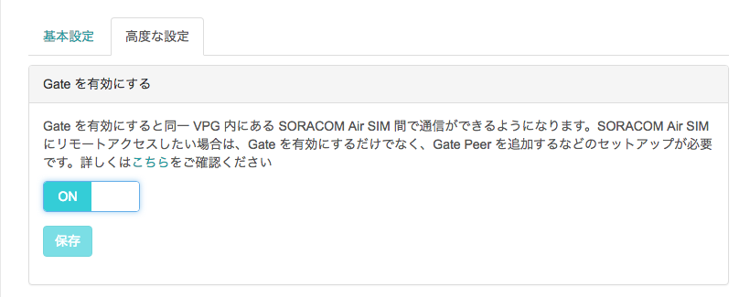

### ステップ 8: Gate Peer からデバイスに接続できることを確認する
ここまでの設定が終わると、お客様の VPC とデバイスが Gate で接続された状態になっています。Gate Peer からデバイスに接続できることを確認しましょう。

まず、Air SIM を使ってデバイスをネットワークに接続します。

- 参考：デバイスの接続例は[Getting Started: 各種デバイスで SORACOM Air を使用する](/jp/start/device_setting/)を参照してください。

Air SIM でデバイスを接続できたら、Gate Peer からデバイスに ping や http でアクセスしてみましょう。

以下は Gate Peer でコマンドを実行し、USB ドングルでネットワーク接続した Raspberry pi に 対して ping と http でアクセスした例です。プライベート IP アドレスで疎通が取れています。

```
[ec2-user@Gate Peer]$ ping 10.219.96.63
PING 10.219.96.63 (10.219.96.63) 56(84) bytes of data.
64 bytes from 10.219.96.63: icmp_seq=1 ttl=64 time=816 ms
64 bytes from 10.219.96.63: icmp_seq=2 ttl=64 time=403 ms
64 bytes from 10.219.96.63: icmp_seq=3 ttl=64 time=423 ms
64 bytes from 10.219.96.63: icmp_seq=4 ttl=64 time=422 ms

[ec2-user@Gate Peer]$  curl http://10.219.96.63
Hello World!
```

以上で Gate のセットアップと動作確認は終了です。

Canalを設定したことで、デバイスからお客様のVPCへの通信が可能となり、Gate を設定したことで、お客様のVPCからデバイスへの通信が可能となりました。

Gate の機能を使わない時には、ユーザコンソールまたは closeGate API によって Gate を無効化することができます。Gate を無効化すると、デバイスへのアクセスを停止することができます。

> Gate の有効化・無効化を切り替える際には数秒間の通信断が発生します。

### ステップ 9: 使い終わったリソースを削除する
SORACOM VPG と Canal, Gate Peer となる AWS EC2 には利用料金がかかります。不要であれば削除しておきましょう。

#### VPG を削除する
VPG を削除する場合、まずは VPC ピア接続の削除とグループの解除が必要です。ユーザコンソールの「閉域網接続」メニューの「基本設定」タブから VPG を選択し VPC ピア接続とグループの解除を実行します。

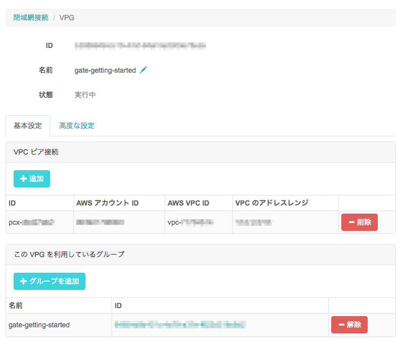

VPC ピア接続とグループの解除が終わったら、続いて「高度な設定」タブで「この VPG を削除」ボタンをクリックします。これで VPG が削除され、グループに対する Canal の設定も解除されます。

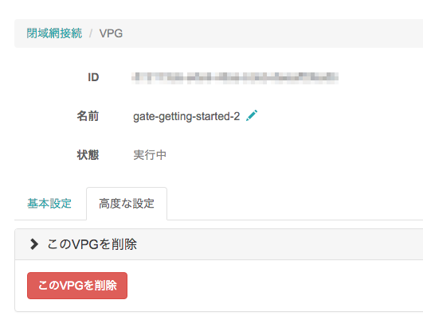

#### Gate Peer を削除する
Cloud Formation スタックの削除を行ってください。削除手順は[AWS CloudFormation ユーザーガイド](https://aws.amazon.com/jp/documentation/cloudformation/)をご覧ください。

## おわりに
以上で SORACOM Canal および Gate のハンズオンは終了となります。

## 参考: トンネリング技術とオーバレイネットワークの概要
Gate で使用している仮想的な L2 ネットワークは、トンネリング技術と、その上で構築されるオーバレイネットワークによって実現されています。これらの技術の背景を把握しておくと Gate の特徴がよく理解できますので、ここで簡単に技術解説をします。

「トンネリング」とは、あるネットワークの上に、仮想的に別のネットワークを構築することを意味しています。このとき仮想的に構築されたネットワークは、もともとのネットワークの上に重なる(overlay)ように構成されるため、「オーバレイネットワーク」と呼ばれます。トンネリングを使ったオーバレイネットワークの実現方法にはいろいろな種類がありますが、Gate では VXLAN が使われています。

トンネリングを使った通信では、本来別々のネットワークにある機器同士で通信を行うために、トンネルの両端にあるエンドポイントでパケットのカプセル化が行われます。具体的には、VXLAN 上で使われるIPアドレス（Inner IP Address）を宛先に持ったパケットを、エンドポイントの IP アドレス（Outer IP Address）を宛先に持つパケットでカプセル化することとなります。これによって、デバイスとお客様のサーバは L3 で分断されているにも関わらず、VXLAN によってデバイスとお客様のサーバは L2 で同じネットワークに接続されているのと同じように通信ができるようになります。

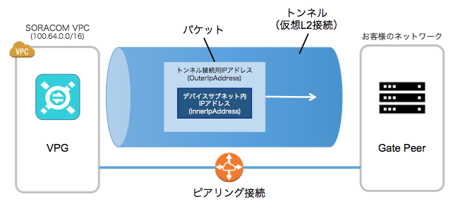
