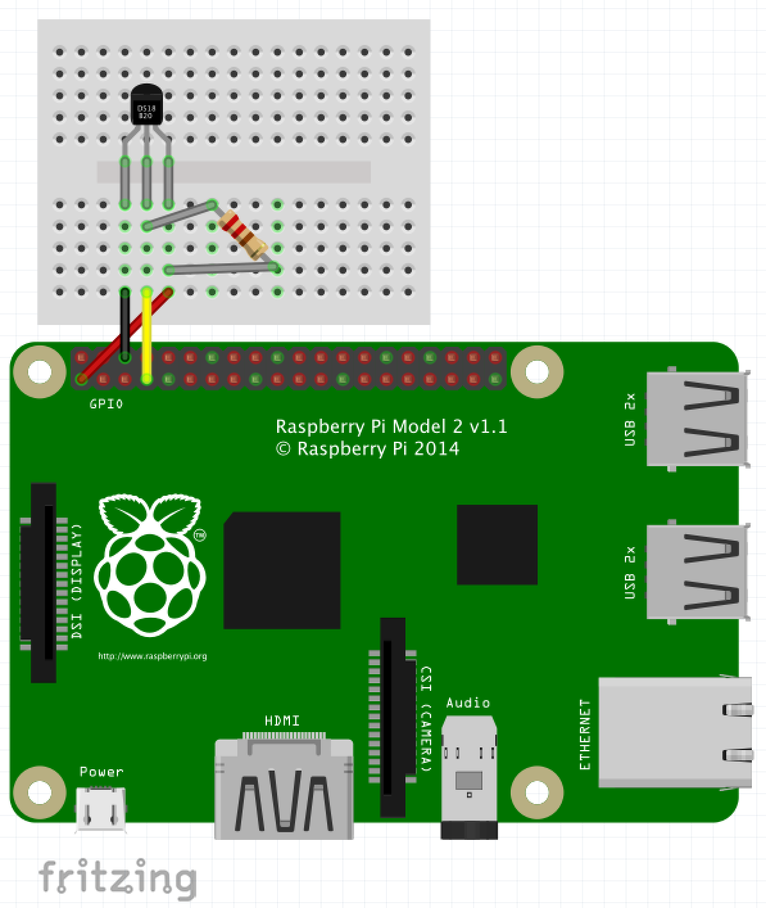

# Chapter 4: 温度センサーを使ったセンシング

## セットアップ
### 配線する
Raspberry Pi の GPIO(General Purpose Input/Output)端子に、温度センサーを接続します。



使うピンは、3.3Vの電源ピン(01)、Ground、GPIO 4の３つです。


### Raspberry Pi で温度センサー DS18B20 を使えるように設定する
以下の２ファイルに設定を追記して、適用するために再起動します。

#### /boot/config.txt
```
dtoverlay=w1-gpio-pullup,gpiopin=4
```

#### /etc/modules
```
w1-gpio
w1-therm
```

以下の例では tee コマンドで追記していますが、操作に慣れている場合には vi や nano などのエディタを利用してもよいです。
もしエディタを使う場合には、sudo を頭に付けるのを忘れないようにしましょう。

#### コマンド
```
echo dtoverlay=w1-gpio-pullup,gpiopin=4 | sudo tee -a /boot/config.txt
(echo w1-gpio ; echo w1-therm ) | sudo tee -a /etc/modules
sudo reboot
```

#### 実行例
```
pi@raspberrypi:~ $ echo dtoverlay=w1-gpio-pullup,gpiopin=4 | sudo tee -a /boot/config.txt
dtoverlay=w1-gpio-pullup,gpiopin=4

pi@raspberrypi:~ $ (echo w1-gpio ; echo w1-therm ) | sudo tee -a /etc/modules
w1-gpio
w1-therm
pi@raspberrypi:~ $ sudo reboot
(再起動が行われ、SSH接続が切れる)
```

しばらく待つと、再起動が完了します。もう一度Raspberry Piにログインしてください。
ログインできたら、Raspberry Piがセンサーを認識できているか確認します。再起動後、センサーは /sys/bus/w1/devices/ 以下にディレクトリとして現れます(28-で始まるものがセンサーです)。
cat コマンドでセンサーデータを読み出してみましょう。

#### コマンド
```
ls /sys/bus/w1/devices/
cat /sys/bus/w1/devices/28-*/w1_slave
```

#### 実行例
```
pi@raspberrypi:~ $ ls /sys/bus/w1/devices/
28-0000072431d2  w1_bus_master1
pi@raspberrypi:~ $ cat /sys/bus/w1/devices/28-*/w1_slave
ea 01 4b 46 7f ff 06 10 cd : crc=cd YES
ea 01 4b 46 7f ff 06 10 cd t=30625
```

上記のように、t=30625 で得られた数字は、摂氏温度の1000倍の数字となってますので、この場合は 30.625度となります。センサーを指で温めたり、風を送って冷ましたりして、温度の変化を確かめてみましょう。


> トラブルシュート：
> - もし28-で始まるディレクトリが表示されない場合は、配線が間違っている可能性があります
> - もし数値が０となる場合、抵抗のつなぎ方が間違っている可能性があります

### Raspberry Pi で CPU 温度を確認する
Raspberry Pi には、CPU の温度を計測するセンサーが組み込まれていますので、こちらの数字も確認してみましょう。

#### コマンド
```
cat /sys/class/thermal/thermal_zone0/temp
```

#### 実行結果
```
pi@raspberrypi:~ $ cat /sys/class/thermal/thermal_zone0/temp
49925
```

こちらも同様に、摂氏温度の1000倍の値となっていますので、この場合は 49.925 度となります。CPU負荷をかける事によって、温度が上がるかどうか見て見ましょう。
CPU負荷を簡単に負荷をかけるには yes コマンドが有用です。"y" をひたすら出力するコマンドですが、/dev/null にリダイレクトする事で、CPU使用率をあげる事ができます。Raspberry Pi2/3 は CPUのコアが４つあるので、４回実行して最大限の負荷をかけます。

#### コマンド
```
yes > /dev/null &
yes > /dev/null &
yes > /dev/null &
yes > /dev/null &
cat /sys/class/thermal/thermal_zone0/temp # 何度か実行して変化を見る
killall yes                               # 負荷をかけていたコマンドを停止
cat /sys/class/thermal/thermal_zone0/temp # 何度か実行して変化を見る
```

#### 実行結果
```
pi@raspberrypi:~ $ cat /sys/class/thermal/thermal_zone0/temp
49925
pi@raspberrypi:~ $ yes > /dev/null &
[1] 2659
pi@raspberrypi:~ $ yes > /dev/null &
[2] 2660
pi@raspberrypi:~ $ yes > /dev/null &
[3] 2661
pi@raspberrypi:~ $ yes > /dev/null &
[4] 2669
pi@raspberrypi:~ $ cat /sys/class/thermal/thermal_zone0/temp
59072
pi@raspberrypi:~ $ cat /sys/class/thermal/thermal_zone0/temp
64990
pi@raspberrypi:~ $ cat /sys/class/thermal/thermal_zone0/temp
67679
pi@raspberrypi:~ $ killall yes
[1]   Terminated              yes > /dev/null
[2]   Terminated              yes > /dev/null
[4]+  Terminated              yes > /dev/null
[3]+  Terminated              yes > /dev/null
pi@raspberrypi:~ $ cat /sys/class/thermal/thermal_zone0/temp
52615
```

## 温度情報を手軽に可視化してみる
SORACOM Harvest を使って、この温度情報を簡単に可視化してみましょう。

### SORACOM Harvest とは
TODO

### SORACOM Harvest の設定をする
TODO

### SORACOM Harvest にデータを送って可視化する
TODO
