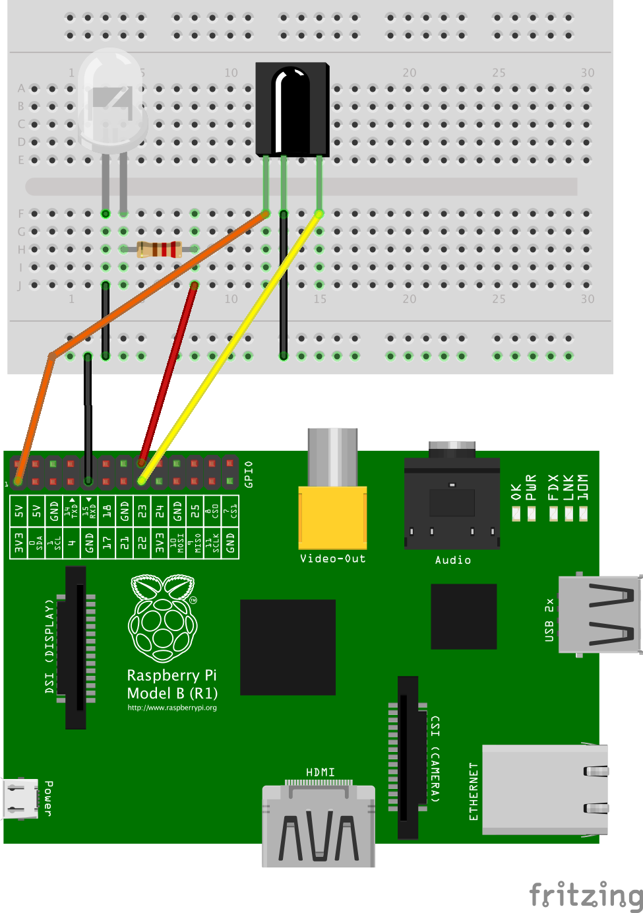
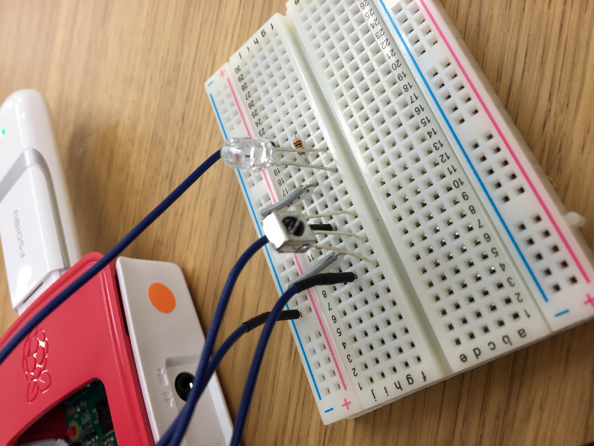
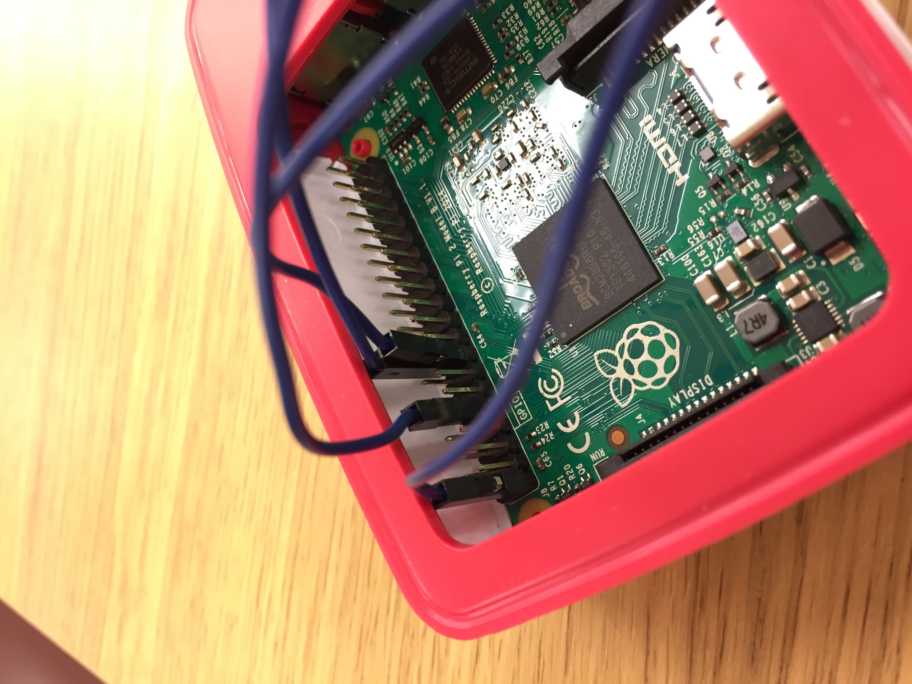

## <a name="chapter5">5章 赤外線リモコンの信号を解析する
- [プログラムのダウンロード](#section5-1)
- [LIRCとは](#section5-2)
- [LIRCのインストール](#section5-3)
- [配線](#section5-4)
- [センサーの動作確認](#section5-5)
- [赤外線信号のデータを取得する](#secion5-6)
- [応用編](#secion5-7)

###  LIRCとは？  
Linux Infrared Remote Controlの略で、Linux上での赤外線信号の送受信のコントロールを簡単にできるようにするためのライブラリです。今回はこのライブラリを使うことによって、送信したい赤外線信号の解析および送信を行っていきます。

### LIRCのインストール
- LIRCをインストールする  
`pi@raspberrypi:~ $ sudo apt-get install lirc`

- LIRCを有効にする  
`pi@raspberrypi:~ $ sudo vim /etc/lirc/hardware.conf`

- hardware.confを以下のコマンドを用いて修正する
```
pi@raspberrypi:~ $ wget https://s3-ap-northeast-1.amazonaws.com/soracom-demo/edit_hardware_conf.sh // スクリプトをダウンロード
pi@raspberrypi:~ $ cp /etc/lirc/hardware.conf ~/hardware.conf // バックアップを取る
pi@raspberrypi:~ $ chmod +x edit_hardware_conf.sh // 実行権限を付与
pi@raspberrypi:~ $ sudo ./edit_hardware_conf.sh // hardware.confを編集
```

- 起動時にLIRCを有効にする。

```
pi@raspberrypi:~ $ wget https://s3-ap-northeast-1.amazonaws.com/soracom-demo/edit_hardware_conf.sh // スクリプトをダウンロード
pi@raspberrypi:~ $ chmod +x edit_boot_conf.sh // 実行権限を付与
pi@raspberrypi:~ $ sudo ./edit_boot_conf.sh // boot/config.txt の末尾にdtoverlay=lirc-rpi,gpio_in_pin=22,gpio_out_pin=23を追加
```

- Raspberry Piを再起動する  
`pi@raspberrypi:~ $ sudo reboot`

- 有効になっているか確認  
下記コマンドを実行して`lirc_rpi`が表示されていることを確認する。
```
pi@raspberrypi:~ $ lsmod | grep lirc
  lirc_rpi                6638  0
  lirc_dev                8169  1 lirc_rpi
  rc_core                16956  1 lirc_dev
```

- LIRCを停止する  
`pi@raspberrypi:~ $ sudo /etc/init.d/lirc stop`

### 配線
- 下記の配線図のように配線を行います。


- 配線後、下記の写真のようになっていることを確認してください(Raspberry Pi 2 B+を使用)




### センサーの動作確認
上記コマンドを実行した後、センサーに向かってリモコンのボタンを押す。
このとき、下記のような数字列が出力されることを確認する。

```
pi@raspberrypi:~ $ mode2 -md /dev/lirc0
490      571      583      595      505      576
556      595      538      592      511      621
511      593     1615      647     1625      576
1654      525     1710      634     1648      589
1645      553     1682      621     1640      592
1645      589      520      612      484      649
510      554     1681      619      501      565
553      617      487      643      484      533
1729      614     1647      593     1617      576
583      585     1649      664     1546      644
1641      590
```

### 赤外線信号のデータを取得する
- 信号の解析データを保存する。  
待機状態になるので、赤外線受信モジュールにリモコンを向けて、一度だけ電源オンボタンを押してください。  
下記コマンドで赤外線信号を解析したデータがpower_on.datに保存されます。  
`pi@raspberrypi:~ $ mode2 -md /dev/lirc0 | tee power_on.dat`

- 信号の解析データを設定ファイルに書き込む   
下記コマンドを実行して、登録名を表示してくださいとでてきたらpower_onと入力。
```
pi@raspberrypi:~ $ sudo ruby ir_tools/irrecord.rb power_on.dat
登録名を入力してください (Ex: switch_on)
power_on
```

### 応用編
- 追加で信号の解析データを保存する。  
待機状態になるので、赤外線受信モジュールにリモコンを向けて、登録したいボタンを一度だけ押してください。    
`pi@raspberrypi:~ $ mode2 -md /dev/lirc0 | tee <ボタンの名称(任意のファイル名も可)>.dat`

- 信号の解析データを設定ファイルに書き込む   
下記コマンドを実行して、登録名を表示してくださいとでてきたら「ボタンの名称」を入力。
```
pi@raspberrypi:~ $ sudo ruby ir_tools/irrecord.rb power_on.dat
ボタンの名称を入力してください (Ex: switch_on)
<power_off等の任意のボタンの名称を入力>
```
これで追加のボタンの信号データが登録されました。  

- 登録されたボタンの一覧を確認する  
`pi@raspberrypi:~ $ irsend LIST controller ""`

- 登録したボタンの信号を送信する  
9章の「SORACOM Beam経由で赤外線信号を送信する」で命令を上記で登録したものに変更すると、新しく登録した赤外線信号が送信できます。
