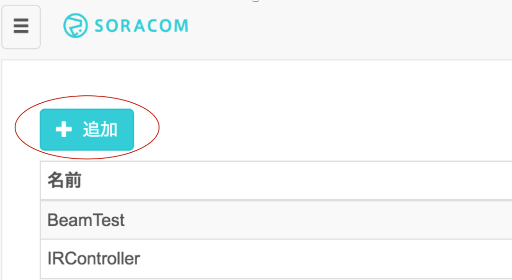
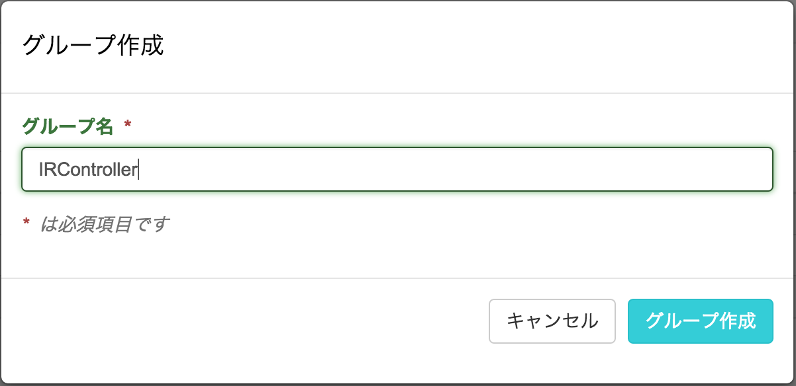
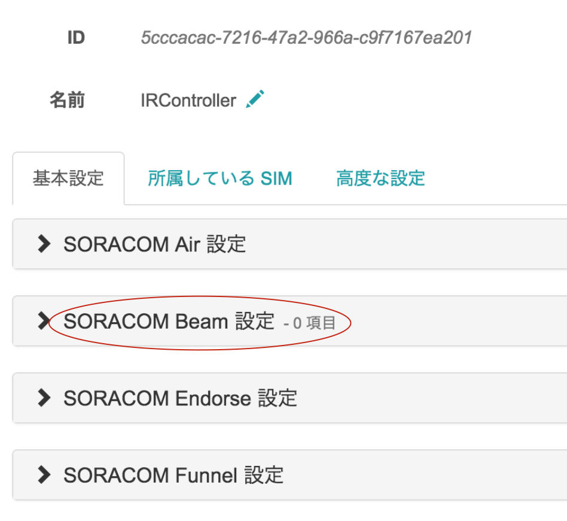
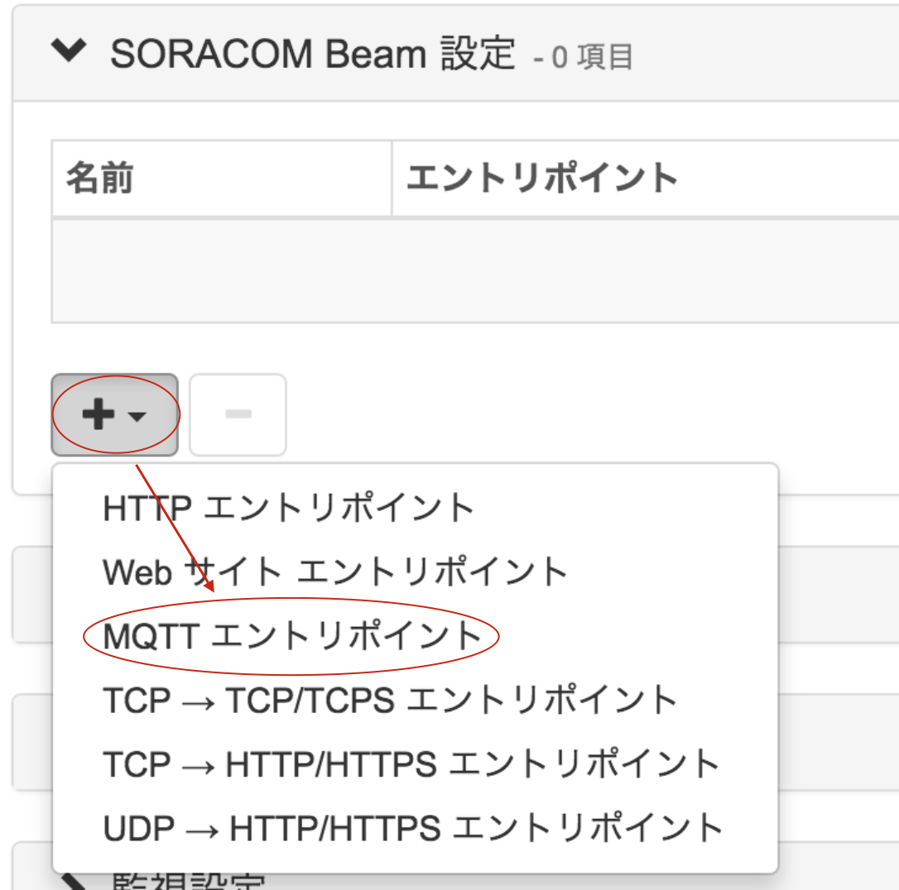
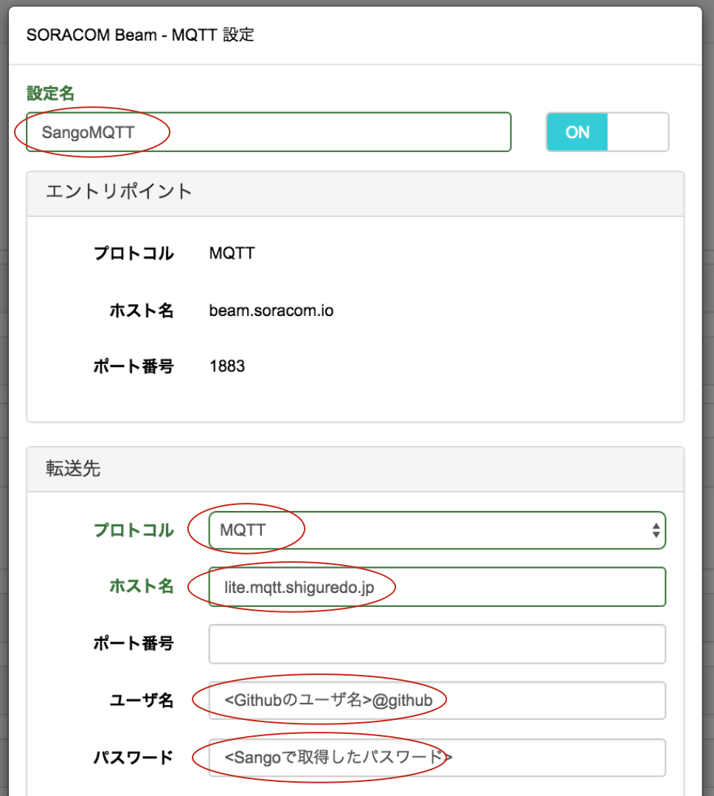

## <a name="chapter8">8章 SORACOM Beamの設定
- [SORACOM Beamとは](#section8-1)
- [SORACOM Beamの設定](#section8-2)
- [グループの作成](#section8-3)
- [SIMのグループ割り当て](#section8-4)

### [SORACOM Beamとは](#section8-1)
SORACOM Beam とは、IoTデバイスにかかる暗号化等の高負荷処理や接続先の設定を、クラウドにオフロードできるサービスです。Beam を利用することによって、暗号化処理が難しいデバイスに代わって、デバイスからサーバー間の通信を暗号化することが可能になります。
プロトコル変換を行うこともできます。例えば、デバイスからはシンプルなTCP、UDPで送信し、BeamでHTTP/HTTPSに変換してクラウドや任意のサーバーに転送することができます。

現在、以下のプロトコル変換に対応しています。  


また、上記のプロトコル変換に加え、Webサイト全体を Beam で転送することもできます。(Webサイトエントリポイント) 全てのパスに対して HTTP で受けた通信を、HTTP または HTTPS で転送を行う設定です。

### [SORACOM Beamの設定](#section8-2)
当ハンズオンでは、以下のBeamを使用します。

- MQTTにおけるユーザ名、パスワードの設定をSORACOM Beamにオフロード(MQTTエンドポイント)

ここでは、Sangoへのデータ転送設定 (MQTTエンドポイント)を設定します。
BeamはAir SIMのグループに対して設定するので、まず、グループを作成します。

### [グループの作成](#section8-3)
- コンソールのメニューから[グループ]から、[追加]をクリックします。



- グループ名を入力して、[グループ作成]をクリック


### [SIMのグループ割り当て](#section8-4)
- SIMをこのグループに紐付けする
SIM管理画面から、SIMを選択して、操作→所属グループ変更を押します。


- 先ほど作成したグループを選択し、[SORACOM Beam 設定] のタブを選択


- [SORACOM Beam 設定] から[MQTTエントリポイント]をクリック


表示された画面で以下のように設定
```
- 設定名： SangoMQTT(別の名前でも構いません)
- 転送先のプロトコル： MQTT
- ホスト名： lite.mqtt.shiguredo.jp
- ユーザ名: <Githubのユーザ名>@github
- パスワード: <Sangoで取得したパスワード>
```


以上でSORACOM Beamの設定は完了です。
