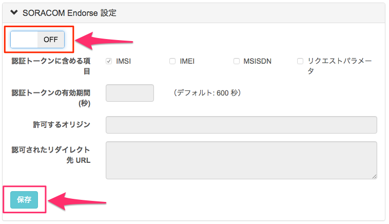
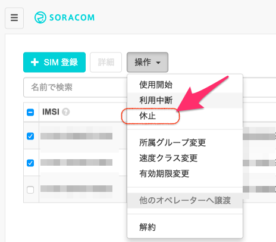
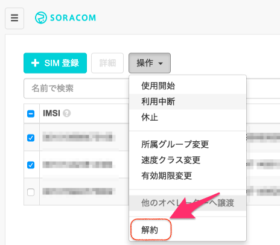
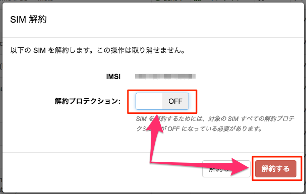

# ラズパイ x ソラコムキャンペーン　植物観察キット　〜後片付けマニュアル〜

***

## <a name="overview">はじめに</a>
植物観察キットのハンズオンお疲れ様でした！このドキュメントでは、植物観察ハンズオンを終了する際の手順を説明します。

このハンズオンで行ったプログラムの設定や、ソラコムサービスの設定をクリアすることで、不要な通信と料金の発生を防ぎます。ハンズオンキットを継続的に使う予定がない方は、このドキュメントに沿って設定の削除をお願いします。

**SORACOM サービスの設定無効化**
ハンズオンで使った各種サービスを無効化し、課金を停止する手順です。

- [各種サービスの設定を無効化](#clear_service_settings)

**Raspberry Piの設定削除**

Raspberry Piの設定を削除し、定期的なデータアップロードや自動接続を無効化する手順です。

- OSイメージを初期化して問題ない場合→[「方法1: Raspberry PiのOSイメージを初期化する」](#reset_os)　へ。
- OSイメージを初期化したくない場合→[方法2: データの自動送信・自動的に3G接続する設定を削除する](#clear_os_settings)へ。

**SIMの休止・解約**

SIMをしばらく使わない・今後使う予定が無い方は、SORACOMサービスの設定無効化・Raspberry Piの後片付けと合わせて、こちらの手順も実行ください。SIMの設定を変更し、通信できないようにします。

- SIMをしばらく使わないが、後で使いたい場合：[方法1: SIMを「休止中」状態にセットする](#inactive_sim)
- SIMを今後使う予定がない場合：[方法2: SIMを解約する](#terminate_sim)

★ハンズオンキットのSIMは、USBドングルだけでなくSIMフリーのスマートフォン等、他のデバイスでも利用可能です。よろしければ、ぜひ継続して使ってみてください。

##  <a name="clear_service_settings">SORACOM サービスの設定無効化</a>
###  Beamの設定を削除する
アカウント作成後1年間は無償枠で決められたリクエスト数は無料でご利用になれますが、今後使わないのであればGroupの設定でBeamの設定を無効化しましょう。

ユーザコンソールのグループ設定画面を開き、「SORACOM Beam設定」をクリックします。続いて「ー」マークのボタンをクリックして、さらに設定の右側に表示される「削除」をクリックしてください。これで設定の削除完了です。


###  Endorseの設定を無効化する
アカウント作成後1年間はSIM 1枚までは無償枠で無料で利用できますが、念のためGroupの設定でEndorseの設定をOFFにしておきましょう。

ユーザコンソールのグループ設定画面を開き、「SORACOM Endose設定」をクリックします。設定のスイッチを「OFF」にセットし、「保存」ボタンをクリックしてください。これで設定の無効化完了です。



##  <a name="reset_raspberry_pi">Raspberry Piの設定削除</a>
###  <a name="reset_os">方法1: Raspberry PiのOSイメージを初期化する</a>

Raspberry Pi からSDカードを取り外し、[Raspberry Piのセットアップ手順](https://github.com/soracom/handson/blob/master/setup/setup.md#section2) に沿ってSDカードにOSイメージを書き込んでください。

これでSDカードのデータが新しいOSイメージで上書きされ、OSはクリーンな状態に戻ります。

###  <a name="clear_settings">方法2: データの自動送信・3G接続の自動実行の設定を削除する</a>

#### データの自動送信の設定を削除する
データの自動送信を行っているcrontabの設定を削除します。

まず、以下のコマンドを実行してください。これでcrontabの設定がすべて削除されます。

```
pi@raspberrypi:~ $ crontab -r
```

続いて、次のコマンドを実行してcrontabの内容を表示し、設定が削除されていることを確認します。
```
pi@raspberrypi:~ $ crontab -l
no crontab for pi 　（← このように表示されたら削除完了です。）
```

#### 自動的に3G接続する設定を削除する
Raspberry Pi 起動のタイミングでconnect_air.shを自動実行（USBドングルによる自動接続）する設定を削除します。

```
pi@raspberrypi:~ $ sudo nano /etc/rc.local (←/etc/rc.local の編集画面を開きます)
```

* 編集画面が開いたら、 ```/usr/local/sbin/connect_air.sh &``` と書かれている行を削除します。
* 削除できたら[Ctrl+O]を押し、さらに[Enter]を押して保存します。
* 保存できたら[Ctrl+X]でnanoを閉じて、設定の削除完了です。

##  <a name="clear_settings">SIMの休止・解約</a>
SIMの通信は、SIMのステータスを休止・解約することで通信を止めることができます。今後の利用予定に合わせて選択ください。

###  <a name="clear_settings">SIMの休止</a>
そのSIMでは通信できない状態となりますが、契約は維持され、**1日10円の基本料金が発生** します。再びSIMを使いたくなったら「使用開始」ステータスにすることで利用再開できます。

SIMを休止中にセットするには、ユーザコンソールにて、休止したいSIMにチェックマークを入れ、「詳細」をクリックします。続いて、「休止」を選択すると、SIMの状態が「休止中」となります。



###  <a name="clear_settings">SIMの解約</a>
SIM自体の契約を解約をします。解約以降は、基本料金・データ通信料金ともに停止します。ただし、**一度「解約」を行うと二度とそのSIMを利用することができません。** 再びAir SIMが必要となった際には、新しいSIMをご購入ください。

SIMを解約するには、ユーザコンソールにて、解約したいAir SIM にチェックを入れ[操作] ボタンをクリックします。続いて[解約] をクリックします。



確認画面が表示されたら、「解約プロテクション」を「OFF」にセットし[解約する] ボタンをクリックすると、SIMの解約完了です。



---

これでハンズオンの後片付けは終わりです。ハンズオンでお伝えした内容が皆さんのお役に立てば幸いです。
