# 「SORACOM x RaspberryPi ハンズオン 」

# ハンズオン用テキスト

### 株式会社ソラコム

#### [1章 ユーザーコンソールを使用してAir SIMを管理する](#section1)
[SORACOM ユーザーアカウントの作成と設定](#section1-1) <br>
[SORACOM アカウントの作成](#section1-2)<br>
[ユーザーコンソールへのログイン](#section1-3)<br>
[支払情報の設定](#section1-4)<br>
[Air SIM の登録](#section1-5)<br>
[ユーザーコンソールでの Air SIM の登録](#section1-6)<br>

#### [2章 Raspberry Piのセットアップ](#section2)
<a name="raspbian-install"> Raspbian のインストール</a>
<a name="ssh-login"> Raspberry Pi への ログイン</a>

#### [3章 Air SIMを使って、インターネットに接続する](#section3)
[Raspberry Pi に USBドングルを接続する](#section3-1)<br>
[必要なパッケージのインストール](#section3-2)<br>
[接続スクリプトのダウンロード](#section3-3)<br>
[Air SIM を使って、インターネットに接続する](#section3-4)<br>

#### [4章 ユーザーコンソールによる通信の確認](#section4)
[データ通信量と利用料金の確認](#section4-1)<br>
[Air SIMのデータ通信量の確認](#section4-2)<br>
[利用料金の確認](#section4-3)<br>
[監視機能の確認](#section4-4)<br>


## はじめに

このハンズオンでは、SORACOMとRaspberryPiのセットアップを行います。
まずは、SORACOMのユーザーアカウントを作成してみましょう。

## <a name="section1"> 1章 ユーザーコンソールを使用してAir SIMを管理する</a>
ここでは、SORACOM ユーザーコンソール(以降、ユーザーコンソール)を使用して、SORACOM AirのSIM (以降、Air SIM)を SORACOMのユーザーアカウントに登録します。ユーザーコンソールを使用するために、ユーザーアカウントの作成、および、支払情報の設定(クレジットカード情報)の登録を行います。


#### <a name="section1-1"> 1.SORACOM ユーザーアカウントの作成と設定</a>
ユーザーコンソールを使用するためには、SORACOMユーザーアカウント(以降、SORACOMアカウント)の作成が必要となります。アカウントの作成には、メールアドレスが必要となります。

#### <a name="section1-2"> SORACOM アカウントの作成</a>
ユーザーコンソールをご利用いただくためには、まずSORACOM アカウントを作成してください。
https://console.soracom.io/#/signup にアクセスします。
「アカウント作成」画面が表示されますのでメールアドレスおよびパスワードを入力して、[アカウントを作成] ボタンをクリックします。

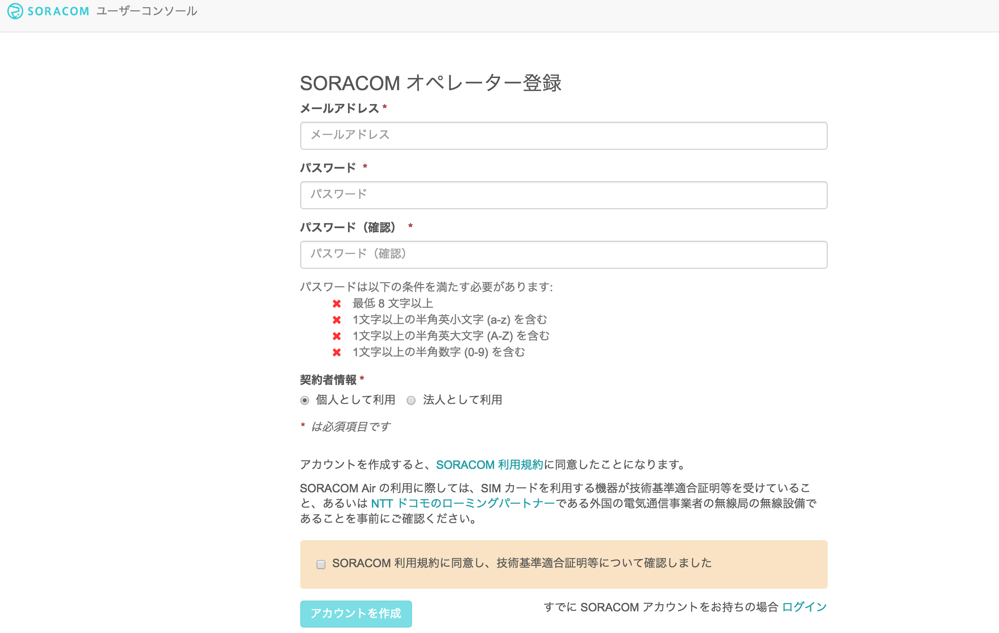

複数人でAir SIMの管理を行う場合は、事前にメーリングリストのアドレスを取得するなど、共有のメールアドレスをご利用ください。
下記の画面が表示されるので、メールを確認してください。


メールが届いたらリンクをクリックしてください。


自動的にログイン画面に遷移しますので、メールアドレスとパスワードを入力してログインしてください。

#### <a name="section1-3"> ユーザーコンソールへのログイン</a>
ログイン画面が表示されるので、アカウント作成時に登録したメールアドレスとパスワードを入力し、 [ログイン] ボタンをクリックしてください。(ログイン画面が表示されない場合はブラウザで https://console.soracom.io にアクセスします。)


以下のような「SIM管理」画面が表示されたらログイン完了です。引き続き、支払情報の設定に進みましょう！
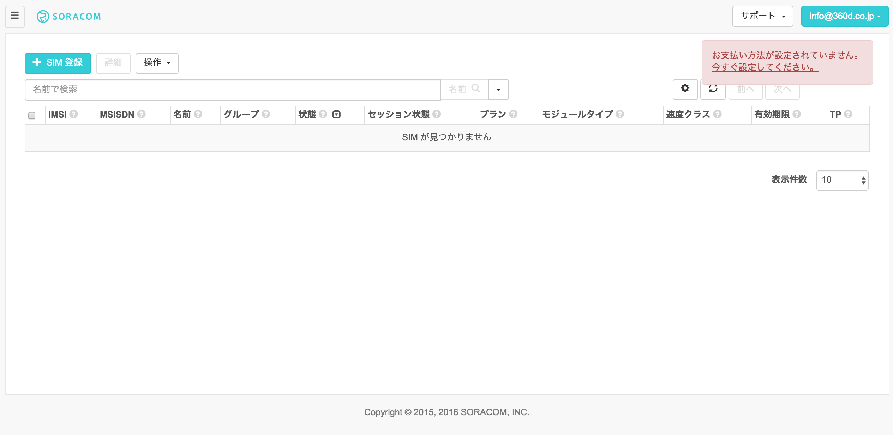



#### <a name="section1-4"> 支払情報の設定</a>
通信料の支払い方法はクレジットカードになります。クレジットカードの情報を登録するには、メイン画面上部のユーザー名から[お支払い方法設定]を開きます。


お支払方法で各情報を入力し、支払い方法を登録します。


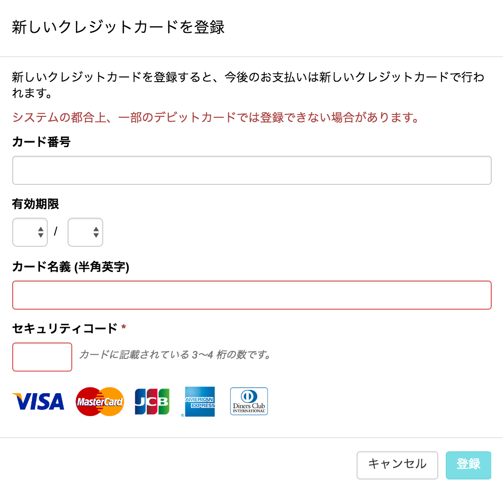


### <a name="section1-5"> 3.Air SIM の登録</a>

#### <a name="section1-6"> ユーザーコンソールでの Air SIM の登録</a>

ユーザーコンソールにログインして、Air SIM の登録を行います。左上の [SIM登録] ボタンをクリックします。
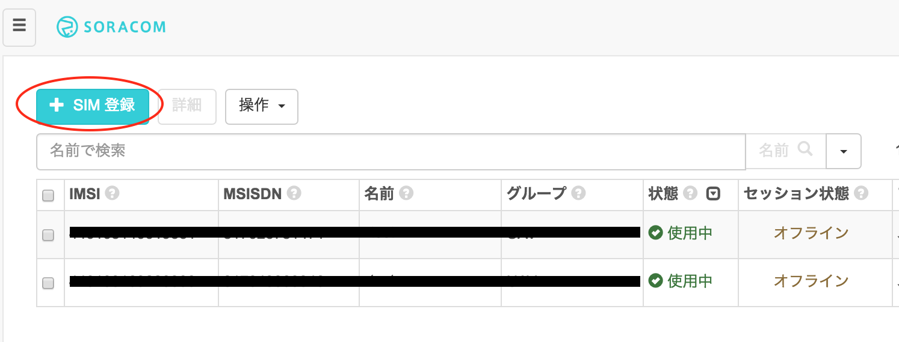


「SIM登録」画面で、Air SIM の台紙の裏面に貼ってある IMSI と PASSCODE を入力してください。


名前、グループは空欄のままでも構いません。[登録] を押して SIM 登録を完了してください。（複数の Air SIM を続けて登録することも可能です。）

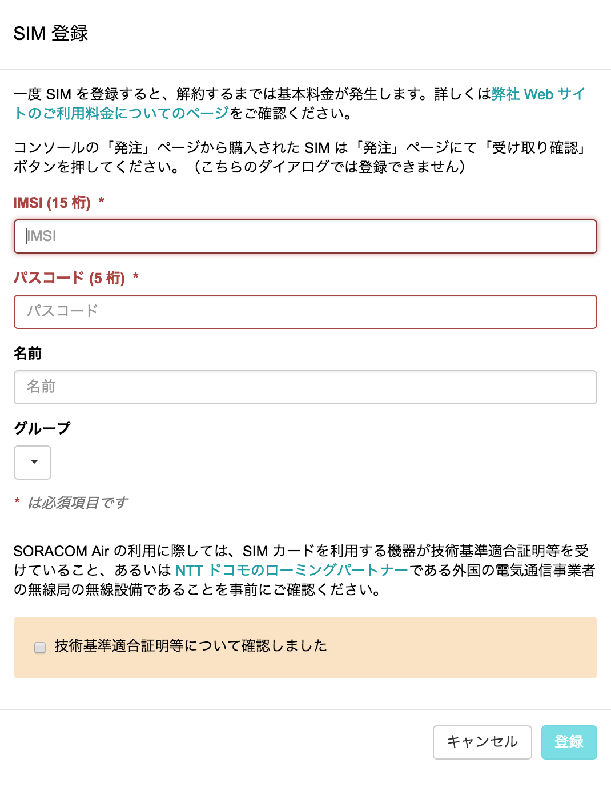


Air SIM を登録した直後の状態は「準備完了」と表示され、通信可能な状態になっています。ただし、まだセッションは確立されていないので、セッション状態は「オフライン」になっていることを確認してください。


SORACOMではSIMの登録や「使用開始」「休止」「解約」といったモバイル通信の状態の更新をユーザー自身がユーザーコンソールを使用して、実施することが可能です。


なお、初めての通信、もしくは、ユーザーコンソール/APIで使用開始処理を行うことで、状態は「使用中」に変わります。 まだ通信を行いたくない場合は、ユーザーコンソールもしくはAPIで休止処理を行ってください。これにより「休止中」の状態となり通信は行われません。

## <a name = "section2"> 2章 Raspberry Piのセットアップ</a>
### <a name="raspbian-install"> Raspbian のインストール</a>
#### Raspbian とは
Raspberry Pi で使用する事ができる OS は様々なものがありますが、最も多く使われているのは、[Raspbian](https://www.raspbian.org) と呼ばれる Raspberry Pi での動作に最適化された Debian ベースの Linux です。

SORACOMのハンズオンでは、特に理由がない限りは Raspbian を利用する前提でスクリプトや手順が作られています。ここでは、Raspbian のインストール(MicroSDへの書き込み)方法について、解説します。

#### 準備
必要なものは以下となります。

- PC(Mac、Windowsなど)
- SDカードリーダー/ライター (PC本体にSDスロットがある場合には不要)
- Micro SD カード (8GB以上が望ましい)  
 ※もし初代Raspberry Piを利用する場合には、通常サイズのSDカードを用意して下さい

#### OSイメージファイルのダウンロード
Raspbian は、デスクトップGUI環境を含む通常版と、CUIのみのLite版があります。  
本ハンズオンでは Raspberry Pi にキーボードやマウスを接続して操作を行わないので、Lite版を利用します。

Raspbian Lite の イメージは、下記URLのミラーサイトからダウンロードするとよいでしょう。  
http://ftp.jaist.ac.jp/pub/raspberrypi/raspbian_lite/images/

- [2016-05-27バージョン(292MB)](http://ftp.jaist.ac.jp/pub/raspberrypi/raspbian_lite/images/raspbian_lite-2016-05-31/2016-05-27-raspbian-jessie-lite.zip) をダウンロード
- zipファイルを解凍して、イメージファイル(2016-05-27-raspbian-jessie-lite.img)を取り出す

#### イメージの書き込み(Macの場合)
##### SDカードの接続
PC本体にSDカードスロットがある場合には、変換アダプタを介して接続して下さい。
   
もしPC本体にSDカードスロットがない場合には、USB接続カードリーダー/ライターなどを使って接続して下 さい。


##### disk番号の確認
接続をしたら、ターミナルを起動して diskutil list というコマンドを実行します。

```
~$ diskutil list
(略) :
/dev/disk4 (external, physical):
   #:                       TYPE NAME                    SIZE       IDENTIFIER
   0:     FDisk_partition_scheme                        *15.6 GB    disk4
   1:                 DOS_FAT_32 NO NAME                 15.6 GB    disk4s1
```

この場合、容量やフォーマットから disk2 がSDカードである事がわかります。環境によって disk3 であったり disk4 であったりする事がありますので、適宜読み替えて下さい。

> 注意： もし誤って disk0 や disk1 に書き込んでしまった場合、OSが起動で きなくなったりする可能性がありますので、十分注意して下さい

##### イメージファイルの書き込み
diskの番号が確認できたら、パーティションをマウント解除し、disk全体にイメージを書き込みます。 書き込みが終わったら eject して、SDカードを取り外します。

```
~$ diskutil unmount disk4s1
Volume NO NAME on disk4s1 unmounted
~$ cd Downloads (イメージファイルを解凍した場所mに応じて読み替えてください)
~/Downloads$ sudo dd if=2016-05-27-raspbian-jessie-lite.img of=/dev/rdisk4 bs=1m
Password: (パスワードを打ち込む)
1048576 bytes transferred in 0.427695 secs (2451691 bytes/sec)
1323+0 records in
1323+0 records out
1387266048 bytes transferred in 128.769184 secs (10773277 bytes/sec)
~/Downloads$ diskutil eject disk4
Disk disk4 ejected
```

#### イメージの書き込み(Windowsの場合)
##### SDカードの接続
PC本体にSDカードスロットがない場合には、USB接続カードリーダー/ライターなどを使って接続して下 さい。


##### Win32 Disk Imager のインストール
[Win32 Disk Imager](https://osdn.jp/projects/sfnet_win32diskimager/)のサイトから、インストーラーをダウンロード・実行します。

##### イメージファイルの書き込み
Win32 Disk Imager を起動し、右上のDeviceがSDカードのドライブ名である事を確認します。  
ドライブ名の左のボタンを押し、イメージファイルの場所を指定します。  
Write を押すと、SDカードへの書き込みが開始されます。


しばらくして、Write Successful. と表示されれば、書き込み完了です。


### <a name="ssh-login"> Raspberry Pi への ログイン</a>
Raspberry Pi へ SSH を使ってログインします。
ユーザ名とパスワードは、それぞれ pi / raspberry になります。

#### 接続先の調べ方
Raspberry Pi は接続元の PC と同じネットワークに有線LANで接続されているものとします。

接続元のPCが以下のいずれかであれば、Raspberry Pi のIPアドレスが分からなくてもログインが可能です。

- Mac を使用している
- Linux 等でAvahiデーモンが動作している
- Windows で Bonjour サービスをインストールしている(iTunesのインストールでもOK)
- Windows10 で mDNS を有効にしている

上記の場合、raspberrypi.local というホスト名でLANに接続された Raspberry Pi に接続が出来ます。

もし上記に該当しない場合、HDMIケーブルを使ってPCモニターやテレビなどに Raspberry Pi を接続し、下記のように画面上に表示される IP アドレスを確認する事が出来ます。

```
My IP address is 192.168.1.xxx
```

#### ssh接続
接続先がわかったら、自分の端末からRaspberry Piに接続(SSH)します。

MacやLinuxの場合には、ターミナルを立ち上げ、以下のコマンドを実行してください。

```
$ ssh pi@raspberrypi.local
The authenticity of host 'raspberrypi.local (fe80::bb8:70cb:474d:220%en0)' can't be established.
ECDSA key fingerprint is SHA256:MOOy0pXAzbJMFh4ZzkYzQS7Dl6YeU2y6TT0mRYKb/MA.
Are you sure you want to continue connecting (yes/no)? yes
Warning: Permanently added 'raspberrypi.local' (ECDSA) to the list of known hosts.
pi@raspberrypi.local's password: (raspberry と入力)

The programs included with the Debian GNU/Linux system are free software;
the exact distribution terms for each program are described in the
individual files in /usr/share/doc/*/copyright.

Debian GNU/Linux comes with ABSOLUTELY NO WARRANTY, to the extent
permitted by applicable law.
Last login: Sun Jun 26 07:09:55 2016 from 192.168.1.101
pi@raspberrypi:~ $
```

Windowsの場合は、[TeraTerm](https://osdn.jp/projects/ttssh2/)を使用するといいでしょう。

パッケージをダウンロードしてインストールした後、プログラムを立ち上げて以下のように接続先を指定して接続します。

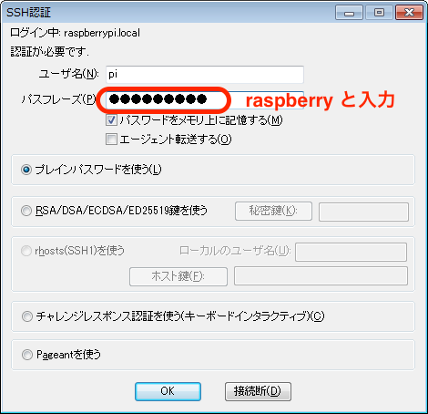

## <a name="section3"> 3章 Air SIMを使って、インターネットに接続する</a>
ここでは、先ほど登録したSORACOM AirのSIM (以降、Air SIM)を使用して、Raspberry Piからインターネットに接続します。

### <a name = "section3−１"> 1.	Raspberry Pi に USBドングルを接続する</a>


Air SIMを取り外します。Air SIMの端子を触らないように気をつけます。


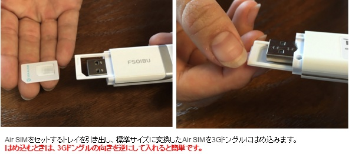
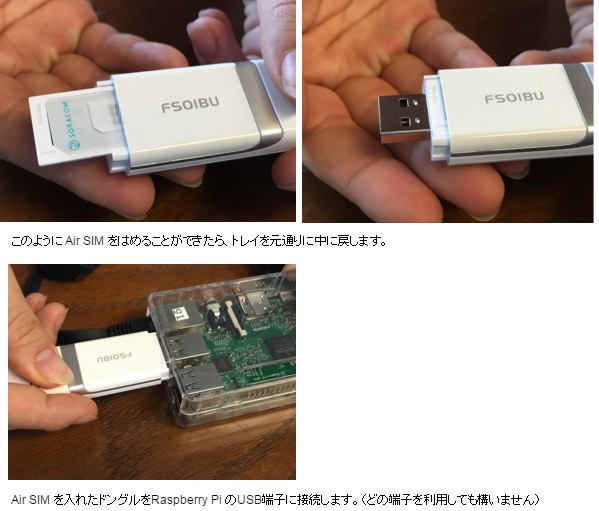


#### Air SIMをドングルから取り出す際の注意

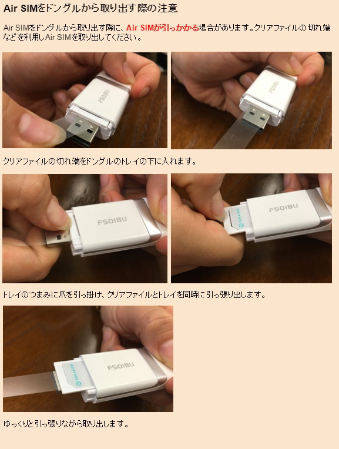


### <a name = "section3−2"> 2.	必要なパッケージのインストール</a>
> ここから先の作業は、Raspberry Pi にログインした状態でコマンドを実行してください

USBドングルを使用するために、以下のパッケージをインストールし、RaspberryPiをセットアップします。
-	usb-modeswitch
-	wvdial

###### usb-modeswitchとwvdialのインストールコマンド

```
pi@raspberrypi:~ $ sudo apt-get install -y usb-modeswitch wvdial
```

```
 	パッケージのインストール中、
  Sorry.  You can retry the autodetection at any time by running "wvdialconf".
     (Or you can create /etc/wvdial.conf yourself.)
と表示されますが、設定ファイル /etc/wvdial.conf は後ほど実行するスクリプトが自動生成しますので、問題ありません。
```

###  <a name = "section3−3"> 3.	接続スクリプトのダウンロード</a>

以下に、モデムの初期化、APNの設定、ダイアルアップなどを行うスクリプトが用意されています。
http://soracom-files.s3.amazonaws.com/connect_air.sh

以下のコマンドを実行し、このスクリプトをダウンロードし、接続用シェルスクリプトを作成します。

```
pi@raspberrypi:~ $ curl -O http://soracom-files.s3.amazonaws.com/connect_air.sh
  % Total    % Received % Xferd  Average Speed   Time    Time     Time  Current
                                 Dload  Upload   Total   Spent    Left  Speed
100  1420  100  1420    0     0   2416      0 --:--:-- --:--:-- --:--:--  2414
pi@raspberrypi ~ $ chmod +x connect_air.sh
pi@raspberrypi ~ $ sudo mv connect_air.sh /usr/local/sbin/

```

### <a name = "section3−4"> 4.	Air SIM を使って、インターネットに接続する</a>

接続の準備ができましたので、接続スクリプトを実行します。接続スクリプトは root 権限で実行する必要があるため、sudoで実行します。

```
pi@raspberrypi:~ $ sudo /usr/local/sbin/connect_air.sh
Bus 001 Device 004: ID 1c9e:98ff OMEGA TECHNOLOGY
Look for target devices ...
 No devices in target mode or class found
Look for default devices ...
   product ID matched
 Found devices in default mode (1)
Access device 004 on bus 001
Current configuration number is 1
Use interface number 0
Use endpoints 0x01 (out) and 0x81 (in)
```

```
USB description data (for identification)

-------------------------
Manufacturer: USB Modem

Product: USB Modem

 Serial No.: 1234567890ABCDEF

-------------------------
Looking for active driver ...
 OK, driver detached
Set up interface 0
Use endpoint 0x01 for message sending ...
Trying to send message 1 to endpoint 0x01 ...
 OK, message successfully sent
Reset response endpoint 0x81
Reset message endpoint 0x01
-> Run lsusb to note any changes. Bye!

insmod /lib/modules/4.1.19-v7+/kernel/drivers/usb/serial/usb_wwan.ko
insmod /lib/modules/4.1.19-v7+/kernel/drivers/usb/serial/option.ko
waiting for modem device
.--> WvDial: Internet dialer version 1.61
--> Cannot get information for serial port.
--> Initializing modem.
--> Sending: ATZ
ATZ
OK
--> Sending: ATQ0 V1 E1 S0=0 &C1 &D2 +FCLASS=0
ATQ0 V1 E1 S0=0 &C1 &D2 +FCLASS=0
OK
--> Sending: AT+CGDCONT=1,"IP","soracom.io"
AT+CGDCONT=1,"IP","soracom.io"
OK
--> Modem initialized.
--> Sending: ATD*99***1#

--> Waiting for carrier.
ATD*99***1#
CONNECT 14400000
--> Carrier detected.  Starting PPP immediately.
--> Starting pppd at Tue Apr 26 04:42:50 2016
--> Pid of pppd: 2395
--> Using interface ppp0
--> pppd: ���v�r[01]�r[01]
--> pppd: ���v�r[01]�r[01]
--> pppd: ���v�r[01]�r[01]
--> pppd: ���v�r[01]�r[01]
--> pppd: ���v�r[01]�r[01]
--> pppd: ���v�r[01]�r[01]
--> local  IP address 10.xxx.xxx.xxx
--> pppd: ���v�r[01]�r[01]
--> remote IP address 10.64.64.64
--> pppd: ���v�r[01]�r[01]
--> primary   DNS address 100.127.0.53
--> pppd: ���v�r[01]�r[01]
--> secondary DNS address 100.127.1.53
--> pppd: ���v�r[01]�r[01]

```

上記のように表示されると接続完了です。

> ハンズオンでは、SORACOM Air による 3G 接続を行っていることが前提となります。データアップロードなどを行うときは、必ず connect_air.sh を実行しながらプログラムを実行してください。

AWS を経由してインターネット接続できていることを確認します。
別のターミナルを立ち上げ、以下のコマンドを実行します。

```
pi@raspberrypi ~ $ curl ifconfig.io
54.65.XXX.XXX  (IPアドレスが表示されます)
pi@raspberrypi ~ $ host 54.65.xxx.xxx
xxx.xxx.65.54.in-addr.arpa domain name pointer ec2-54-65-xx-xxx.ap-northeast-1.compute.amazonaws.com.
```

CurlコマンドによるIPアドレスとhostコマンドにより、EC2からインターネットに接続されていることがわかりました。

**（参考）Raspberry Pi が起動したタイミングで自動的に connect_air.sh を実行するには**

Raspberry Pi が起動したタイミングで自動的に 3G 接続を行うには、以下のように設定してください。

* vi や nano で /etc/rc.local ファイルを開きます。
* ファイルの中にある```exit 0``` の前の行に、```/usr/local/sbin/connect_air.sh &``` と書き込みます。
* /etc/rc.local ファイルを保存して終了すると、設定完了です。


## <a name = "section4"> 4章 ユーザーコンソールによる通信の確認</a>
インターネットに接続できましたので、ユーザーコンソールからデータ通信量、利用料金を確認して、監視機能を設定しましょう。


### <a name = "section4-1"> 1.	データ通信量と利用料金の確認</a>

#### <a name = "section4-2"> Air SIMのデータ通信量の確認</a>
ユーザーコンソールでは、データ通信量をSORACOM AirのSIM(以降、Air SIM)ごとにチャート形式で確認することができます。<br>
データ通信量を確認したいAir SIMにチェックを入れ [詳細] ボタンをクリックします。

[SIM 詳細] ダイアログが表示されますので、[通信量履歴] タブを開きます。 データ使用量は、表示期間を変更することもできます。

 	データ通信量が反映されるまでに5〜10分かかります。
先ほどのデータ通信が反映されていない場合はしばらくお待ちください。


#### <a name = "section4-3"> 利用料金の確認</a>

ユーザーコンソールからデータ通信料金と基本料金を確認できます。
メイン画面左上部のプルダウンメニューから [課金情報] を選択します。

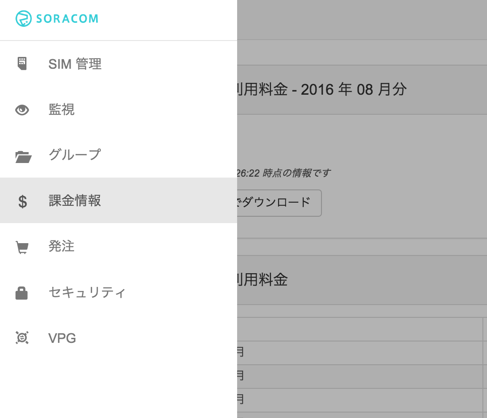


表示されている時間時点の課金情報を確認することができます。

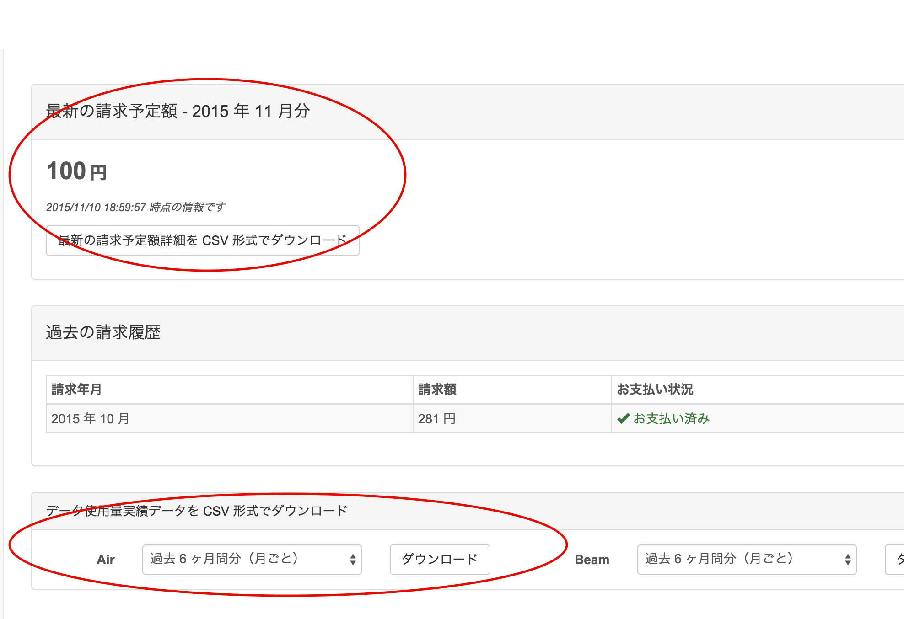


また、画面下部にある [データ使用量実績データを CSV 形式でダウンロード] から、期間を選択して [ダウンロード] ボタンをクリックすることで、基本料金、転送データ量などの詳細を確認することができます。


```
 	請求額詳細のCSVには、IMSIごとに以下の項目が記載されています。
✓	date (日付)
✓	billItemName (basicCharge は基本料金、upload/downloadDataChargeは転送データ量に対する課金)
✓	quantity (数量: upload/downloadDataChargeの場合の単位はバイト)
✓	amount (金額: 日ごとの料金。この項目の総合計が、月額請求額となります)
✓	タグ、グループ
```

#### <a name = "section4-4"> 監視機能の確認</a>
通信量にしきい値を設定し、超えた場合にメールでの通知と通信帯域制限をすることができます。監視できる項目は以下のとおりです。
●	各 SIM の日次通信量
●	各 SIM の今月の合計通信量
●	全ての SIM の今月の合計通信

例えば、全ての Air SIM の合計通信量が5000MB以上になった場合にメール通知を受けたい場合や、ある Air SIM の日次通信量が100MB以上になった場合にはその日の通信速度を制限するというような処理を行いたい場合に、この機能を利用することができます。

通信量はメガバイト単位（1以上の整数値）で入力できます。メールの宛先は登録されているメールアドレスです。通信速度を制限した場合は s1.minimum になり、解除された際は、 s1.standard に復帰します。 (APIを用いた場合には、制限時の通信速度、制限解除時の通信速度を任意に設定することも可能です)

Air SIMに監視の設定をしましょう。当ハンズオンの間に通知がくるように、1MiBで設定します。

「SIM詳細」画面で [監視] タブを開き、[SIM] をクリックして、監視設定を行ったら [設定を更新] ボタンをクリックして保存します。  


ここでの設定は、対象のAir SIMごとに有効になります。

```
 	監視の設定は、以下の3つを対象することができます。
✓	Air SIM<br>
✓	(Air SIMの所属する)グループ<br>
✓	(登録した)全てのSIM
```


すぐに、メール通知を確認したい場合は、Raspberry Piから以下のコマンドを実行して、1MiBのダウンロードを実施してみてください。

```
pi@raspberrypi ~ $ wget http://soracom-files.s3.amazonaws.com/1MB
```

以下のような通知が届きます。(通知は最大で5分程度かかります。)

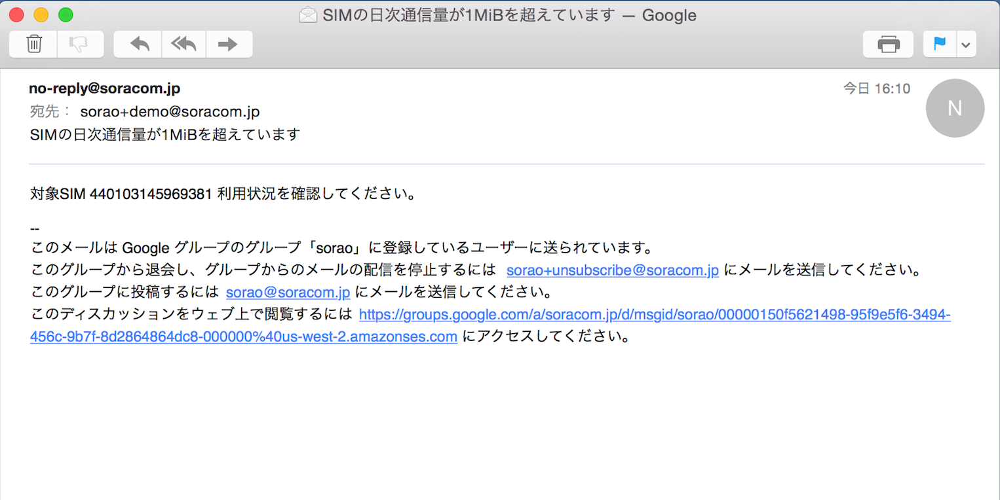


SORACOMに興味を持っていただいた方は、以下の Getting Startedもご覧ください！

SORACOM Getting Started
https://dev.soracom.io/jp/start/
